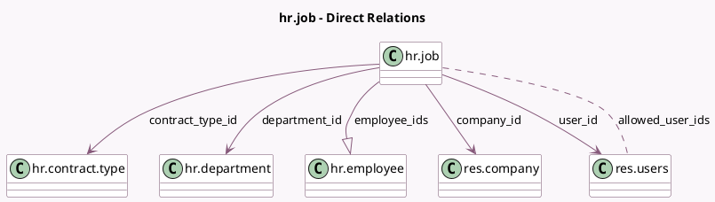

<!-- GENERATED:MODEL -->
---
tags: [odoo, community, generated, model]
---

# hr.job

- Module: [[docs/Community Addons/hr/hr|hr]]
- Scope: Community Addons
- Defined in module: yes
- Source files: `models/hr_job.py`
- Python classes: `HrJob`
- Description: Job Position
- Inherits: `mail.thread`

## Field footprint

- Detected fields: 14
- Field types: `Boolean` x 1, `Char` x 1, `Html` x 1, `Integer` x 4, `Many2many` x 1, `Many2one` x 4, `One2many` x 1, `Text` x 1
- Relation fields: 6

## Sample fields

- `active`: `Boolean`
- `allowed_user_ids`: `Many2many` (comodel `res.users`, compute `_compute_allowed_user_ids`)
- `company_id`: `Many2one` (comodel `res.company`)
- `contract_type_id`: `Many2one` (comodel `hr.contract.type`)
- `department_id`: `Many2one` (comodel `hr.department`)
- `description`: `Html`
- `employee_ids`: `One2many` (comodel `hr.employee`)
- `expected_employees`: `Integer` (compute `_compute_employees`)
- `name`: `Char`
- `no_of_employee`: `Integer` (compute `_compute_employees`)
- `no_of_recruitment`: `Integer`
- `requirements`: `Text` (comodel `Requirements`)
- `sequence`: `Integer`
- `user_id`: `Many2one` (comodel `res.users`)

## Method hints

- Detected methods: 5
- Action methods: none
- Compute methods: `_compute_allowed_user_ids`, `_compute_employees`
- Onchange methods: none

## Direct relation diagram

## Navigation

- **Parent:** [[docs/Community Addons/hr/Models]]

<!-- GENERATED:MODEL -->
