<!-- GENERATED:MODEL -->
---
tags: [odoo, community, generated, model]
---

# hr.payroll.structure.type

- Module: [[docs/Community Addons/hr/hr|hr]]
- Scope: Community Addons
- Defined in module: yes
- Source files: `models/hr_payroll_structure_type.py`
- Python classes: `HrPayrollStructureType`
- Description: Salary Structure Type

## Field footprint

- Detected fields: 4
- Field types: `Char` x 2, `Many2one` x 2
- Relation fields: 2

## Sample fields

- `country_code`: `Char` (related `country_id.code`)
- `country_id`: `Many2one` (comodel `res.country`)
- `default_resource_calendar_id`: `Many2one` (comodel `resource.calendar`)
- `name`: `Char` (comodel `Salary Structure Type`)

## Method hints

- Detected methods: 0
- Action methods: none
- Compute methods: none
- Onchange methods: none

## Direct relation diagram

```plantuml
@startuml
!define ODOO_COLOR_PRIMARY #714B67
!define ODOO_COLOR_ACCENT #875A7B
!define ODOO_COLOR_BG #FAF7FA

skinparam backgroundColor ODOO_COLOR_BG
skinparam defaultTextAlignment left
skinparam ArrowColor ODOO_COLOR_ACCENT
skinparam ClassBackgroundColor white
skinparam ClassBorderColor ODOO_COLOR_PRIMARY
skinparam ComponentBackgroundColor white
skinparam ComponentBorderColor ODOO_COLOR_PRIMARY
skinparam NoteBackgroundColor #FFF8FF
skinparam NoteBorderColor ODOO_COLOR_ACCENT
skinparam SequenceLifeLineBorderColor ODOO_COLOR_ACCENT
skinparam SequenceLifeLineBackgroundColor #FFFFFF
skinparam SequenceParticipantBorderColor ODOO_COLOR_PRIMARY
skinparam SequenceParticipantBackgroundColor #FFFFFF
skinparam sequence {
  ArrowColor ODOO_COLOR_ACCENT
  ActorBorderColor ODOO_COLOR_PRIMARY
}
title hr.payroll.structure.type - Direct Relations
class "hr.payroll.structure.type" as hr_payroll_structure_type
class "res.country" as res_country
class "resource.calendar" as resource_calendar
hr_payroll_structure_type --> resource_calendar : default_resource_calendar_id
hr_payroll_structure_type --> res_country : country_id
@enduml
```

## Navigation

- **Parent:** [[docs/Community Addons/hr/Models]]

<!-- GENERATED:MODEL -->
