<!-- GENERATED:MODEL -->
---
tags: [odoo, community, generated, model]
---

# hr.version

- Module: [[docs/Community Addons/hr/hr|hr]]
- Scope: Community Addons
- Defined in module: yes
- Source files: `models/hr_version.py`
- Python classes: `HrVersion`
- Description: Version
- Inherits: `mail.activity.mixin`, `mail.thread`

## Field footprint

- Detected fields: 63
- Field types: `Boolean` x 10, `Char` x 12, `Date` x 9, `Datetime` x 1, `Html` x 1, `Integer` x 3, `Many2many` x 1, `Many2one` x 18, `Monetary` x 2, `Selection` x 5, `Text` x 1
- Relation fields: 19

## Sample fields

- `active`: `Boolean`
- `active_employee`: `Boolean` (related `employee_id.active`)
- `additional_note`: `Text`
- `address_id`: `Many2one` (comodel `res.partner`, store `True`)
- `allowed_country_state_ids`: `Many2many` (comodel `res.country.state`, compute `_compute_allowed_country_state_ids`)
- `children`: `Integer`
- `company_country_id`: `Many2one` (comodel `res.country`, related `company_id.country_id`)
- `company_id`: `Many2one` (comodel `res.company`, compute `_compute_company_id`, store `True`)
- `contract_date_end`: `Date` (comodel `Contract End Date`)
- `contract_date_start`: `Date` (comodel `Contract Start Date`)
- `contract_template_id`: `Many2one` (comodel `hr.version`)
- `contract_type_id`: `Many2one` (comodel `hr.contract.type`)
- `contract_wage`: `Monetary` (comodel `Contract Wage`, compute `_compute_contract_wage`)
- `country_code`: `Char` (related `company_country_id.code`)
- `country_id`: `Many2one` (comodel `res.country`)
- `currency_id`: `Many2one` (related `company_id.currency_id`)
- `date_end`: `Date` (compute `_compute_dates`)
- `date_start`: `Date` (compute `_compute_dates`)
- `date_version`: `Date`
- `department_id`: `Many2one` (comodel `hr.department`)

## Method hints

- Detected methods: 44
- Action methods: `action_open_version`
- Compute methods: `_compute_allowed_country_state_ids`, `_compute_company_id`, `_compute_contract_wage`, `_compute_dates`, `_compute_display_name`, `_compute_is_current`, `_compute_is_custom_job_title`, `_compute_is_flexible`, and 7 more
- Onchange methods: none

## Direct relation diagram

```plantuml
@startuml
!define ODOO_COLOR_PRIMARY #714B67
!define ODOO_COLOR_ACCENT #875A7B
!define ODOO_COLOR_BG #FAF7FA

skinparam backgroundColor ODOO_COLOR_BG
skinparam defaultTextAlignment left
skinparam ArrowColor ODOO_COLOR_ACCENT
skinparam ClassBackgroundColor white
skinparam ClassBorderColor ODOO_COLOR_PRIMARY
skinparam ComponentBackgroundColor white
skinparam ComponentBorderColor ODOO_COLOR_PRIMARY
skinparam NoteBackgroundColor #FFF8FF
skinparam NoteBorderColor ODOO_COLOR_ACCENT
skinparam SequenceLifeLineBorderColor ODOO_COLOR_ACCENT
skinparam SequenceLifeLineBackgroundColor #FFFFFF
skinparam SequenceParticipantBorderColor ODOO_COLOR_PRIMARY
skinparam SequenceParticipantBackgroundColor #FFFFFF
skinparam sequence {
  ArrowColor ODOO_COLOR_ACCENT
  ActorBorderColor ODOO_COLOR_PRIMARY
}
title hr.version - Direct Relations
class "hr.version" as hr_version
class "hr.contract.type" as hr_contract_type
class "hr.department" as hr_department
class "hr.departure.reason" as hr_departure_reason
class "hr.employee" as hr_employee
class "hr.job" as hr_job
class "hr.payroll.structure.type" as hr_payroll_structure_type
class "hr.version" as hr_version
class "hr.work.location" as hr_work_location
class "res.company" as res_company
class "res.country" as res_country
class "res.country.state" as res_country_state
class "res.partner" as res_partner
hr_version --> res_company : company_id
hr_version --> hr_employee : employee_id
hr_version --> res_users : last_modified_uid
hr_version --> res_country : country_id
hr_version .. res_country_state : allowed_country_state_ids
hr_version --> res_country_state : private_state_id
hr_version --> res_country : private_country_id
hr_version --> hr_department : department_id
hr_version --> hr_job : job_id
hr_version --> res_partner : address_id
hr_version --> hr_work_location : work_location_id
hr_version --> hr_departure_reason : departure_reason_id
hr_version --> resource_calendar : resource_calendar_id
hr_version --> hr_version : contract_template_id
hr_version --> hr_payroll_structure_type : structure_type_id
hr_version --> res_country : company_country_id
hr_version --> hr_contract_type : contract_type_id
@enduml
```

## Navigation

- **Parent:** [[docs/Community Addons/hr/Models]]

<!-- GENERATED:MODEL -->
