<!-- GENERATED:MODEL -->
---
tags: [odoo, community, generated, model]
---

# hr.work.location

- Module: [[docs/Community Addons/hr/hr|hr]]
- Scope: Community Addons
- Defined in module: yes
- Source files: `models/hr_work_location.py`
- Python classes: `HrWorkLocation`
- Description: Work Location

## Field footprint

- Detected fields: 6
- Field types: `Boolean` x 1, `Char` x 2, `Many2one` x 2, `Selection` x 1
- Relation fields: 2

## Sample fields

- `active`: `Boolean`
- `address_id`: `Many2one` (comodel `res.partner`)
- `company_id`: `Many2one` (comodel `res.company`)
- `location_number`: `Char`
- `location_type`: `Selection`
- `name`: `Char`

## Method hints

- Detected methods: 0
- Action methods: none
- Compute methods: none
- Onchange methods: none

## Direct relation diagram

```plantuml
@startuml
!define ODOO_COLOR_PRIMARY #714B67
!define ODOO_COLOR_ACCENT #875A7B
!define ODOO_COLOR_BG #FAF7FA

skinparam backgroundColor ODOO_COLOR_BG
skinparam defaultTextAlignment left
skinparam ArrowColor ODOO_COLOR_ACCENT
skinparam ClassBackgroundColor white
skinparam ClassBorderColor ODOO_COLOR_PRIMARY
skinparam ComponentBackgroundColor white
skinparam ComponentBorderColor ODOO_COLOR_PRIMARY
skinparam NoteBackgroundColor #FFF8FF
skinparam NoteBorderColor ODOO_COLOR_ACCENT
skinparam SequenceLifeLineBorderColor ODOO_COLOR_ACCENT
skinparam SequenceLifeLineBackgroundColor #FFFFFF
skinparam SequenceParticipantBorderColor ODOO_COLOR_PRIMARY
skinparam SequenceParticipantBackgroundColor #FFFFFF
skinparam sequence {
  ArrowColor ODOO_COLOR_ACCENT
  ActorBorderColor ODOO_COLOR_PRIMARY
}
title hr.work.location - Direct Relations
class "hr.work.location" as hr_work_location
class "res.company" as res_company
class "res.partner" as res_partner
hr_work_location --> res_company : company_id
hr_work_location --> res_partner : address_id
@enduml
```

## Navigation

- **Parent:** [[docs/Community Addons/hr/Models]]

<!-- GENERATED:MODEL -->
