<!-- GENERATED:MODEL -->
---
tags: [odoo, community, generated, model]
---

# mail.activity.schedule

- Module: [[docs/Community Addons/hr/hr|hr]]
- Scope: Community Addons
- Defined in module: extension only
- Source files: `wizard/mail_activity_schedule.py`
- Python classes: `MailActivitySchedule`

## Field footprint

- Detected fields: 2
- Field types: `Boolean` x 1, `Many2one` x 1
- Relation fields: 1

## Sample fields

- `department_id`: `Many2one` (comodel `hr.department`, compute `_compute_department_id`)
- `plan_department_filterable`: `Boolean` (compute `_compute_plan_department_filterable`)

## Method hints

- Detected methods: 4
- Action methods: none
- Compute methods: `_compute_department_id`, `_compute_plan_available_ids`, `_compute_plan_date`, `_compute_plan_department_filterable`
- Onchange methods: none

## Direct relation diagram

```plantuml
@startuml
!define ODOO_COLOR_PRIMARY #714B67
!define ODOO_COLOR_ACCENT #875A7B
!define ODOO_COLOR_BG #FAF7FA

skinparam backgroundColor ODOO_COLOR_BG
skinparam defaultTextAlignment left
skinparam ArrowColor ODOO_COLOR_ACCENT
skinparam ClassBackgroundColor white
skinparam ClassBorderColor ODOO_COLOR_PRIMARY
skinparam ComponentBackgroundColor white
skinparam ComponentBorderColor ODOO_COLOR_PRIMARY
skinparam NoteBackgroundColor #FFF8FF
skinparam NoteBorderColor ODOO_COLOR_ACCENT
skinparam SequenceLifeLineBorderColor ODOO_COLOR_ACCENT
skinparam SequenceLifeLineBackgroundColor #FFFFFF
skinparam SequenceParticipantBorderColor ODOO_COLOR_PRIMARY
skinparam SequenceParticipantBackgroundColor #FFFFFF
skinparam sequence {
  ArrowColor ODOO_COLOR_ACCENT
  ActorBorderColor ODOO_COLOR_PRIMARY
}
title mail.activity.schedule - Direct Relations
class "mail.activity.schedule" as mail_activity_schedule
class "hr.department" as hr_department
mail_activity_schedule --> hr_department : department_id
@enduml
```

## Navigation

- **Parent:** [[docs/Community Addons/hr/Models]]

<!-- GENERATED:MODEL -->
