<!-- GENERATED:MODEL -->
---
tags: [odoo, community, generated, model]
---

# res.config.settings

- Module: [[docs/Community Addons/hr/hr|hr]]
- Scope: Community Addons
- Defined in module: extension only
- Source files: `models/res_config_settings.py`
- Python classes: `ResConfigSettings`

## Field footprint

- Detected fields: 11
- Field types: `Boolean` x 6, `Char` x 1, `Integer` x 3, `Many2one` x 1
- Relation fields: 1

## Sample fields

- `contract_expiration_notice_period`: `Integer` (related `company_id.contract_expiration_notice_period`)
- `hr_presence_control_email`: `Boolean` (related `company_id.hr_presence_control_email`)
- `hr_presence_control_email_amount`: `Integer` (related `company_id.hr_presence_control_email_amount`)
- `hr_presence_control_ip`: `Boolean` (related `company_id.hr_presence_control_ip`)
- `hr_presence_control_ip_list`: `Char` (related `company_id.hr_presence_control_ip_list`)
- `hr_presence_control_login`: `Boolean` (related `company_id.hr_presence_control_login`)
- `module_hr_attendance`: `Boolean` (related `company_id.hr_presence_control_attendance`)
- `module_hr_presence`: `Boolean`
- `module_hr_skills`: `Boolean`
- `resource_calendar_id`: `Many2one` (comodel `resource.calendar`, related `company_id.resource_calendar_id`)
- `work_permit_expiration_notice_period`: `Integer` (related `company_id.work_permit_expiration_notice_period`)

## Method hints

- Detected methods: 0
- Action methods: none
- Compute methods: none
- Onchange methods: none

## Direct relation diagram

```plantuml
@startuml
!define ODOO_COLOR_PRIMARY #714B67
!define ODOO_COLOR_ACCENT #875A7B
!define ODOO_COLOR_BG #FAF7FA

skinparam backgroundColor ODOO_COLOR_BG
skinparam defaultTextAlignment left
skinparam ArrowColor ODOO_COLOR_ACCENT
skinparam ClassBackgroundColor white
skinparam ClassBorderColor ODOO_COLOR_PRIMARY
skinparam ComponentBackgroundColor white
skinparam ComponentBorderColor ODOO_COLOR_PRIMARY
skinparam NoteBackgroundColor #FFF8FF
skinparam NoteBorderColor ODOO_COLOR_ACCENT
skinparam SequenceLifeLineBorderColor ODOO_COLOR_ACCENT
skinparam SequenceLifeLineBackgroundColor #FFFFFF
skinparam SequenceParticipantBorderColor ODOO_COLOR_PRIMARY
skinparam SequenceParticipantBackgroundColor #FFFFFF
skinparam sequence {
  ArrowColor ODOO_COLOR_ACCENT
  ActorBorderColor ODOO_COLOR_PRIMARY
}
title res.config.settings - Direct Relations
class "res.config.settings" as res_config_settings
class "resource.calendar" as resource_calendar
res_config_settings --> resource_calendar : resource_calendar_id
@enduml
```

## Navigation

- **Parent:** [[docs/Community Addons/hr/Models]]

<!-- GENERATED:MODEL -->
