<!-- GENERATED:MODEL -->
---
tags: [odoo, community, generated, model]
---

# res.partner.bank

- Module: [[docs/Community Addons/hr/hr|hr]]
- Scope: Community Addons
- Defined in module: extension only
- Source files: `models/res_partner_bank.py`
- Python classes: `ResPartnerBank`

## Field footprint

- Detected fields: 13
- Field types: `Boolean` x 2, `Char` x 7, `Float` x 1, `Many2many` x 1, `Many2one` x 2
- Relation fields: 3

## Sample fields

- `bank_city`: `Char` (related `bank_id.city`)
- `bank_country`: `Many2one` (related `bank_id.country`)
- `bank_email`: `Char` (related `bank_id.email`)
- `bank_phone`: `Char` (related `bank_id.phone`)
- `bank_state`: `Many2one` (related `bank_id.state`)
- `bank_street`: `Char` (related `bank_id.street`)
- `bank_street2`: `Char` (related `bank_id.street2`)
- `bank_zip`: `Char` (related `bank_id.zip`)
- `currency_symbol`: `Char` (related `currency_id.symbol`)
- `employee_has_multiple_bank_accounts`: `Boolean` (related `employee_id.has_multiple_bank_accounts`)
- `employee_id`: `Many2many` (comodel `hr.employee`, compute `_compute_employee_id`)
- `employee_salary_amount`: `Float` (compute `_compute_salary_amount`, store `False`)
- `employee_salary_amount_is_percentage`: `Boolean` (compute `_compute_salary_amount`, store `False`)

## Method hints

- Detected methods: 5
- Action methods: `action_open_allocation_wizard`
- Compute methods: `_compute_display_name`, `_compute_employee_id`, `_compute_salary_amount`
- Onchange methods: none

## Direct relation diagram

```plantuml
@startuml
!define ODOO_COLOR_PRIMARY #714B67
!define ODOO_COLOR_ACCENT #875A7B
!define ODOO_COLOR_BG #FAF7FA

skinparam backgroundColor ODOO_COLOR_BG
skinparam defaultTextAlignment left
skinparam ArrowColor ODOO_COLOR_ACCENT
skinparam ClassBackgroundColor white
skinparam ClassBorderColor ODOO_COLOR_PRIMARY
skinparam ComponentBackgroundColor white
skinparam ComponentBorderColor ODOO_COLOR_PRIMARY
skinparam NoteBackgroundColor #FFF8FF
skinparam NoteBorderColor ODOO_COLOR_ACCENT
skinparam SequenceLifeLineBorderColor ODOO_COLOR_ACCENT
skinparam SequenceLifeLineBackgroundColor #FFFFFF
skinparam SequenceParticipantBorderColor ODOO_COLOR_PRIMARY
skinparam SequenceParticipantBackgroundColor #FFFFFF
skinparam sequence {
  ArrowColor ODOO_COLOR_ACCENT
  ActorBorderColor ODOO_COLOR_PRIMARY
}
title res.partner.bank - Direct Relations
class "res.partner.bank" as res_partner_bank
class "hr.employee" as hr_employee
res_partner_bank .. hr_employee : employee_id
@enduml
```

## Navigation

- **Parent:** [[docs/Community Addons/hr/Models]]

<!-- GENERATED:MODEL -->
