<!-- GENERATED:MODEL -->
---
tags: [odoo, community, generated, model]
---

# res.partner

- Module: [[docs/Community Addons/hr/hr|hr]]
- Scope: Community Addons
- Defined in module: extension only
- Source files: `models/res_partner.py`
- Python classes: `ResPartner`

## Field footprint

- Detected fields: 3
- Field types: `Boolean` x 1, `Integer` x 1, `One2many` x 1
- Relation fields: 1

## Sample fields

- `employee`: `Boolean` (compute `_compute_employee`, store `True`)
- `employee_ids`: `One2many` (comodel `hr.employee`)
- `employees_count`: `Integer` (compute `_compute_employees_count`)

## Method hints

- Detected methods: 7
- Action methods: `action_open_employees`
- Compute methods: `_compute_employee`, `_compute_employees_count`
- Onchange methods: none

## Direct relation diagram

```plantuml
@startuml
!define ODOO_COLOR_PRIMARY #714B67
!define ODOO_COLOR_ACCENT #875A7B
!define ODOO_COLOR_BG #FAF7FA

skinparam backgroundColor ODOO_COLOR_BG
skinparam defaultTextAlignment left
skinparam ArrowColor ODOO_COLOR_ACCENT
skinparam ClassBackgroundColor white
skinparam ClassBorderColor ODOO_COLOR_PRIMARY
skinparam ComponentBackgroundColor white
skinparam ComponentBorderColor ODOO_COLOR_PRIMARY
skinparam NoteBackgroundColor #FFF8FF
skinparam NoteBorderColor ODOO_COLOR_ACCENT
skinparam SequenceLifeLineBorderColor ODOO_COLOR_ACCENT
skinparam SequenceLifeLineBackgroundColor #FFFFFF
skinparam SequenceParticipantBorderColor ODOO_COLOR_PRIMARY
skinparam SequenceParticipantBackgroundColor #FFFFFF
skinparam sequence {
  ArrowColor ODOO_COLOR_ACCENT
  ActorBorderColor ODOO_COLOR_PRIMARY
}
title res.partner - Direct Relations
class "res.partner" as res_partner
class "hr.employee" as hr_employee
res_partner --|> hr_employee : employee_ids
@enduml
```

## Navigation

- **Parent:** [[docs/Community Addons/hr/Models]]

<!-- GENERATED:MODEL -->
