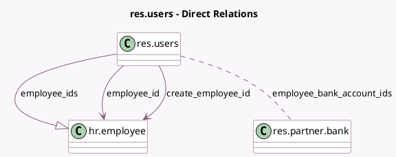

<!-- GENERATED:MODEL -->
---
tags: [odoo, community, generated, model]
---

# res.users

- Module: [[docs/Community Addons/hr/hr|hr]]
- Scope: Community Addons
- Defined in module: extension only
- Source files: `models/res_users.py`
- Python classes: `ResUsers`

## Field footprint

- Detected fields: 34
- Field types: `Boolean` x 3, `Char` x 15, `Date` x 1, `Integer` x 2, `Many2many` x 3, `Many2one` x 7, `One2many` x 1, `Selection` x 1, `Text` x 1
- Relation fields: 11

## Sample fields

- `additional_note`: `Text` (related `employee_id.additional_note`)
- `bank_account_ids`: `Many2many` (related `employee_id.bank_account_ids`)
- `barcode`: `Char` (related `employee_id.barcode`)
- `category_ids`: `Many2many` (related `employee_id.category_ids`)
- `create_employee`: `Boolean` (store `False`)
- `create_employee_id`: `Many2one` (comodel `hr.employee`, store `False`)
- `emergency_contact`: `Char` (related `employee_id.emergency_contact`)
- `emergency_phone`: `Char` (related `employee_id.emergency_phone`)
- `employee_bank_account_ids`: `Many2many` (comodel `res.partner.bank`, related `employee_id.bank_account_ids`)
- `employee_count`: `Integer` (compute `_compute_employee_count`)
- `employee_id`: `Many2one` (comodel `hr.employee`, compute `_compute_company_employee`, store `False`)
- `employee_ids`: `One2many` (comodel `hr.employee`)
- `employee_resource_calendar_id`: `Many2one` (related `employee_id.resource_calendar_id`)
- `is_hr_user`: `Boolean` (compute `_compute_is_hr_user`)
- `is_system`: `Boolean` (compute `_compute_is_system`)
- `job_title`: `Char` (related `employee_id.job_title`)
- `km_home_work`: `Integer` (related `employee_id.km_home_work`)
- `mobile_phone`: `Char` (related `employee_id.mobile_phone`)
- `pin`: `Char` (related `employee_id.pin`)
- `private_city`: `Char` (related `employee_id.private_city`)

## Method hints

- Detected methods: 20
- Action methods: `action_create_employee`, `action_get`, `action_open_employees`, `action_related_contact`
- Compute methods: `_compute_company_employee`, `_compute_employee_count`, `_compute_is_hr_user`, `_compute_is_system`
- Onchange methods: `_onchange_private_state_id`

## Direct relation diagram

## Navigation

- **Parent:** [[docs/Community Addons/hr/Models]]

<!-- GENERATED:MODEL -->
