<!-- GENERATED:MODEL -->
---
tags: [odoo, community, generated, model]
---

# resource.resource

- Module: [[docs/Community Addons/hr/hr|hr]]
- Scope: Community Addons
- Defined in module: extension only
- Source files: `models/resource.py`
- Python classes: `ResourceResource`

## Field footprint

- Detected fields: 10
- Field types: `Boolean` x 1, `Char` x 3, `Many2one` x 4, `One2many` x 1, `Selection` x 1
- Relation fields: 5

## Sample fields

- `calendar_id`: `Many2one`
- `department_id`: `Many2one` (comodel `hr.department`, compute `_compute_department_id`)
- `employee_id`: `One2many` (comodel `hr.employee`)
- `hr_icon_display`: `Selection` (related `employee_id.hr_icon_display`)
- `job_title`: `Char` (compute `_compute_job_title`)
- `show_hr_icon_display`: `Boolean` (related `employee_id.show_hr_icon_display`)
- `user_id`: `Many2one`
- `work_email`: `Char` (related `employee_id.work_email`)
- `work_location_id`: `Many2one` (related `employee_id.work_location_id`)
- `work_phone`: `Char` (related `employee_id.work_phone`)

## Method hints

- Detected methods: 8
- Action methods: none
- Compute methods: `_compute_avatar_128`, `_compute_department_id`, `_compute_job_title`
- Onchange methods: none

## Direct relation diagram

```plantuml
@startuml
!define ODOO_COLOR_PRIMARY #714B67
!define ODOO_COLOR_ACCENT #875A7B
!define ODOO_COLOR_BG #FAF7FA

skinparam backgroundColor ODOO_COLOR_BG
skinparam defaultTextAlignment left
skinparam ArrowColor ODOO_COLOR_ACCENT
skinparam ClassBackgroundColor white
skinparam ClassBorderColor ODOO_COLOR_PRIMARY
skinparam ComponentBackgroundColor white
skinparam ComponentBorderColor ODOO_COLOR_PRIMARY
skinparam NoteBackgroundColor #FFF8FF
skinparam NoteBorderColor ODOO_COLOR_ACCENT
skinparam SequenceLifeLineBorderColor ODOO_COLOR_ACCENT
skinparam SequenceLifeLineBackgroundColor #FFFFFF
skinparam SequenceParticipantBorderColor ODOO_COLOR_PRIMARY
skinparam SequenceParticipantBackgroundColor #FFFFFF
skinparam sequence {
  ArrowColor ODOO_COLOR_ACCENT
  ActorBorderColor ODOO_COLOR_PRIMARY
}
title resource.resource - Direct Relations
class "resource.resource" as resource_resource
class "hr.department" as hr_department
class "hr.employee" as hr_employee
resource_resource --|> hr_employee : employee_id
resource_resource --> hr_department : department_id
@enduml
```

## Navigation

- **Parent:** [[docs/Community Addons/hr/Models]]

<!-- GENERATED:MODEL -->
