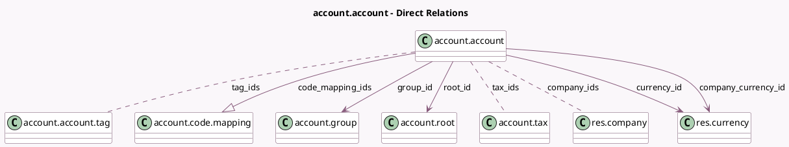

<!-- GENERATED:MODEL -->
---
tags: [odoo, community, generated, model]
---

# account.account

- Module: [[docs/Community Addons/account/account|account]]
- Scope: Community Addons
- Defined in module: yes
- Source files: `models/account_account.py`
- Python classes: `AccountAccount`
- Description: Account
- Inherits: `mail.activity.mixin`, `mail.thread`

## Field footprint

- Detected fields: 28
- Field types: `Boolean` x 6, `Char` x 5, `Float` x 1, `Integer` x 1, `Many2many` x 3, `Many2one` x 4, `Monetary` x 3, `One2many` x 1, `Selection` x 2, `Text` x 2
- Relation fields: 8

## Sample fields

- `account_type`: `Selection` (compute `_compute_account_type`, store `True`)
- `active`: `Boolean`
- `code`: `Char` (compute `_compute_code`)
- `code_mapping_ids`: `One2many` (comodel `account.code.mapping`)
- `code_store`: `Char`
- `company_currency_id`: `Many2one` (comodel `res.currency`, compute `_compute_company_currency_id`)
- `company_fiscal_country_code`: `Char` (compute `_compute_company_fiscal_country_code`)
- `company_ids`: `Many2many` (comodel `res.company`)
- `currency_id`: `Many2one` (comodel `res.currency`)
- `current_balance`: `Float` (compute `_compute_current_balance`)
- `description`: `Text`
- `display_mapping_tab`: `Boolean` (store `False`)
- `group_id`: `Many2one` (comodel `account.group`, compute `_compute_account_group`)
- `include_initial_balance`: `Boolean` (compute `_compute_include_initial_balance`)
- `internal_group`: `Selection` (compute `_compute_internal_group`)
- `name`: `Char`
- `non_trade`: `Boolean`
- `note`: `Text` (comodel `Internal Notes`)
- `opening_balance`: `Monetary` (compute `_compute_opening_debit_credit`)
- `opening_credit`: `Monetary` (compute `_compute_opening_debit_credit`)

## Method hints

- Detected methods: 72
- Action methods: `action_open_related_taxes`, `action_unmerge`
- Compute methods: `_compute_account_group`, `_compute_account_root`, `_compute_account_tags`, `_compute_account_type`, `_compute_code`, `_compute_company_currency_id`, `_compute_company_fiscal_country_code`, `_compute_current_balance`, and 8 more
- Onchange methods: `_onchange_account_type`, `_onchange_name`

## Direct relation diagram

## Navigation

- **Parent:** [[docs/Community Addons/account/Models]]

<!-- GENERATED:MODEL -->
