<!-- GENERATED:MODEL -->
---
tags: [odoo, community, generated, model]
---

# account.account.tag

- Module: [[docs/Community Addons/account/account|account]]
- Scope: Community Addons
- Defined in module: yes
- Source files: `models/account_account_tag.py`
- Python classes: `AccountAccountTag`
- Description: Account Tag

## Field footprint

- Detected fields: 7
- Field types: `Boolean` x 2, `Char` x 1, `Integer` x 1, `Many2one` x 2, `Selection` x 1
- Relation fields: 2

## Sample fields

- `active`: `Boolean`
- `applicability`: `Selection`
- `balance_negate`: `Boolean` (compute `_compute_report_expression_id`)
- `color`: `Integer` (comodel `Color Index`)
- `country_id`: `Many2one` (comodel `res.country`)
- `name`: `Char` (comodel `Tag Name`)
- `report_expression_id`: `Many2one` (comodel `account.report.expression`, compute `_compute_report_expression_id`)

## Method hints

- Detected methods: 9
- Action methods: none
- Compute methods: `_compute_display_name`, `_compute_report_expression_id`
- Onchange methods: none

## Direct relation diagram

```plantuml
@startuml
!define ODOO_COLOR_PRIMARY #714B67
!define ODOO_COLOR_ACCENT #875A7B
!define ODOO_COLOR_BG #FAF7FA

skinparam backgroundColor ODOO_COLOR_BG
skinparam defaultTextAlignment left
skinparam ArrowColor ODOO_COLOR_ACCENT
skinparam ClassBackgroundColor white
skinparam ClassBorderColor ODOO_COLOR_PRIMARY
skinparam ComponentBackgroundColor white
skinparam ComponentBorderColor ODOO_COLOR_PRIMARY
skinparam NoteBackgroundColor #FFF8FF
skinparam NoteBorderColor ODOO_COLOR_ACCENT
skinparam SequenceLifeLineBorderColor ODOO_COLOR_ACCENT
skinparam SequenceLifeLineBackgroundColor #FFFFFF
skinparam SequenceParticipantBorderColor ODOO_COLOR_PRIMARY
skinparam SequenceParticipantBackgroundColor #FFFFFF
skinparam sequence {
  ArrowColor ODOO_COLOR_ACCENT
  ActorBorderColor ODOO_COLOR_PRIMARY
}
title account.account.tag - Direct Relations
class "account.account.tag" as account_account_tag
class "account.report.expression" as account_report_expression
class "res.country" as res_country
account_account_tag --> res_country : country_id
account_account_tag --> account_report_expression : report_expression_id
@enduml
```

## Navigation

- **Parent:** [[docs/Community Addons/account/Models]]

<!-- GENERATED:MODEL -->
