<!-- GENERATED:MODEL -->
---
tags: [odoo, community, generated, model]
---

# account.accrued.orders.wizard

- Module: [[docs/Community Addons/account/account|account]]
- Scope: Community Addons
- Defined in module: yes
- Source files: `wizard/accrued_orders.py`
- Python classes: `AccountAccruedOrdersWizard`
- Description: Accrued Orders Wizard

## Field footprint

- Detected fields: 9
- Field types: `Boolean` x 1, `Date` x 2, `Many2one` x 4, `Monetary` x 1, `Text` x 1
- Relation fields: 4

## Sample fields

- `account_id`: `Many2one` (comodel `account.account`)
- `amount`: `Monetary`
- `company_id`: `Many2one` (comodel `res.company`)
- `currency_id`: `Many2one` (related `company_id.currency_id`, store `True`)
- `date`: `Date`
- `display_amount`: `Boolean` (compute `_compute_display_amount`)
- `journal_id`: `Many2one` (comodel `account.journal`, compute `_compute_journal_id`, store `True`)
- `preview_data`: `Text` (compute `_compute_preview_data`)
- `reversal_date`: `Date` (compute `_compute_reversal_date`, store `True`)

## Method hints

- Detected methods: 9
- Action methods: none
- Compute methods: `_compute_display_amount`, `_compute_journal_id`, `_compute_move_vals`, `_compute_preview_data`, `_compute_reversal_date`
- Onchange methods: none

## Direct relation diagram

```plantuml
@startuml
!define ODOO_COLOR_PRIMARY #714B67
!define ODOO_COLOR_ACCENT #875A7B
!define ODOO_COLOR_BG #FAF7FA

skinparam backgroundColor ODOO_COLOR_BG
skinparam defaultTextAlignment left
skinparam ArrowColor ODOO_COLOR_ACCENT
skinparam ClassBackgroundColor white
skinparam ClassBorderColor ODOO_COLOR_PRIMARY
skinparam ComponentBackgroundColor white
skinparam ComponentBorderColor ODOO_COLOR_PRIMARY
skinparam NoteBackgroundColor #FFF8FF
skinparam NoteBorderColor ODOO_COLOR_ACCENT
skinparam SequenceLifeLineBorderColor ODOO_COLOR_ACCENT
skinparam SequenceLifeLineBackgroundColor #FFFFFF
skinparam SequenceParticipantBorderColor ODOO_COLOR_PRIMARY
skinparam SequenceParticipantBackgroundColor #FFFFFF
skinparam sequence {
  ArrowColor ODOO_COLOR_ACCENT
  ActorBorderColor ODOO_COLOR_PRIMARY
}
title account.accrued.orders.wizard - Direct Relations
class "account.accrued.orders.wizard" as account_accrued_orders_wizard
class "account.account" as account_account
class "account.journal" as account_journal
class "res.company" as res_company
account_accrued_orders_wizard --> res_company : company_id
account_accrued_orders_wizard --> account_journal : journal_id
account_accrued_orders_wizard --> account_account : account_id
@enduml
```

## Navigation

- **Parent:** [[docs/Community Addons/account/Models]]

<!-- GENERATED:MODEL -->
