<!-- GENERATED:MODEL -->
---
tags: [odoo, community, generated, model]
---

# account.analytic.applicability

- Module: [[docs/Community Addons/account/account|account]]
- Scope: Community Addons
- Defined in module: extension only
- Source files: `models/account_analytic_plan.py`
- Python classes: `AccountAnalyticApplicability`
- Description: Analytic Plan's Applicabilities

## Field footprint

- Detected fields: 5
- Field types: `Boolean` x 1, `Char` x 2, `Many2one` x 1, `Selection` x 1
- Relation fields: 1

## Sample fields

- `account_prefix`: `Char`
- `account_prefix_placeholder`: `Char` (compute `_compute_prefix_placeholder`)
- `business_domain`: `Selection`
- `display_account_prefix`: `Boolean` (compute `_compute_display_account_prefix`)
- `product_categ_id`: `Many2one` (comodel `product.category`)

## Method hints

- Detected methods: 3
- Action methods: none
- Compute methods: `_compute_display_account_prefix`, `_compute_prefix_placeholder`
- Onchange methods: none

## Direct relation diagram

```plantuml
@startuml
!define ODOO_COLOR_PRIMARY #714B67
!define ODOO_COLOR_ACCENT #875A7B
!define ODOO_COLOR_BG #FAF7FA

skinparam backgroundColor ODOO_COLOR_BG
skinparam defaultTextAlignment left
skinparam ArrowColor ODOO_COLOR_ACCENT
skinparam ClassBackgroundColor white
skinparam ClassBorderColor ODOO_COLOR_PRIMARY
skinparam ComponentBackgroundColor white
skinparam ComponentBorderColor ODOO_COLOR_PRIMARY
skinparam NoteBackgroundColor #FFF8FF
skinparam NoteBorderColor ODOO_COLOR_ACCENT
skinparam SequenceLifeLineBorderColor ODOO_COLOR_ACCENT
skinparam SequenceLifeLineBackgroundColor #FFFFFF
skinparam SequenceParticipantBorderColor ODOO_COLOR_PRIMARY
skinparam SequenceParticipantBackgroundColor #FFFFFF
skinparam sequence {
  ArrowColor ODOO_COLOR_ACCENT
  ActorBorderColor ODOO_COLOR_PRIMARY
}
title account.analytic.applicability - Direct Relations
class "account.analytic.applicability" as account_analytic_applicability
class "product.category" as product_category
account_analytic_applicability --> product_category : product_categ_id
@enduml
```

## Navigation

- **Parent:** [[docs/Community Addons/account/Models]]

<!-- GENERATED:MODEL -->
