<!-- GENERATED:MODEL -->
---
tags: [odoo, community, generated, model]
---

# account.analytic.distribution.model

- Module: [[docs/Community Addons/account/account|account]]
- Scope: Community Addons
- Defined in module: extension only
- Source files: `models/account_analytic_distribution_model.py`
- Python classes: `AccountAnalyticDistributionModel`

## Field footprint

- Detected fields: 4
- Field types: `Char` x 2, `Many2one` x 2
- Relation fields: 2

## Sample fields

- `account_prefix`: `Char`
- `prefix_placeholder`: `Char` (compute `_compute_prefix_placeholder`)
- `product_categ_id`: `Many2one` (comodel `product.category`)
- `product_id`: `Many2one` (comodel `product.product`)

## Method hints

- Detected methods: 4
- Action methods: none
- Compute methods: `_compute_prefix_placeholder`
- Onchange methods: none

## Direct relation diagram

```plantuml
@startuml
!define ODOO_COLOR_PRIMARY #714B67
!define ODOO_COLOR_ACCENT #875A7B
!define ODOO_COLOR_BG #FAF7FA

skinparam backgroundColor ODOO_COLOR_BG
skinparam defaultTextAlignment left
skinparam ArrowColor ODOO_COLOR_ACCENT
skinparam ClassBackgroundColor white
skinparam ClassBorderColor ODOO_COLOR_PRIMARY
skinparam ComponentBackgroundColor white
skinparam ComponentBorderColor ODOO_COLOR_PRIMARY
skinparam NoteBackgroundColor #FFF8FF
skinparam NoteBorderColor ODOO_COLOR_ACCENT
skinparam SequenceLifeLineBorderColor ODOO_COLOR_ACCENT
skinparam SequenceLifeLineBackgroundColor #FFFFFF
skinparam SequenceParticipantBorderColor ODOO_COLOR_PRIMARY
skinparam SequenceParticipantBackgroundColor #FFFFFF
skinparam sequence {
  ArrowColor ODOO_COLOR_ACCENT
  ActorBorderColor ODOO_COLOR_PRIMARY
}
title account.analytic.distribution.model - Direct Relations
class "account.analytic.distribution.model" as account_analytic_distribution_model
class "product.category" as product_category
class "product.product" as product_product
account_analytic_distribution_model --> product_product : product_id
account_analytic_distribution_model --> product_category : product_categ_id
@enduml
```

## Navigation

- **Parent:** [[docs/Community Addons/account/Models]]

<!-- GENERATED:MODEL -->
