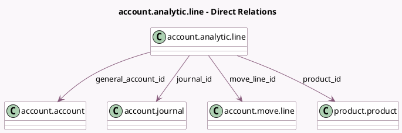

<!-- GENERATED:MODEL -->
---
tags: [odoo, community, generated, model]
---

# account.analytic.line

- Module: [[docs/Community Addons/account/account|account]]
- Scope: Community Addons
- Defined in module: extension only
- Source files: `models/account_analytic_line.py`
- Python classes: `AccountAnalyticLine`
- Description: Analytic Line

## Field footprint

- Detected fields: 8
- Field types: `Char` x 2, `Many2one` x 5, `Selection` x 1
- Relation fields: 5

## Sample fields

- `category`: `Selection`
- `code`: `Char`
- `general_account_id`: `Many2one` (comodel `account.account`, compute `_compute_general_account_id`, store `True`)
- `journal_id`: `Many2one` (comodel `account.journal`, related `move_line_id.journal_id`, store `True`)
- `move_line_id`: `Many2one` (comodel `account.move.line`)
- `partner_id`: `Many2one` (compute `_compute_partner_id`, store `True`)
- `product_id`: `Many2one` (comodel `product.product`)
- `ref`: `Char`

## Method hints

- Detected methods: 8
- Action methods: none
- Compute methods: `_compute_general_account_id`, `_compute_partner_id`
- Onchange methods: `on_change_unit_amount`

## Direct relation diagram

## Navigation

- **Parent:** [[docs/Community Addons/account/Models]]

<!-- GENERATED:MODEL -->
