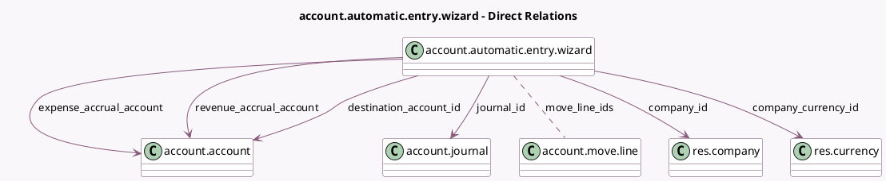

<!-- GENERATED:MODEL -->
---
tags: [odoo, community, generated, model]
---

# account.automatic.entry.wizard

- Module: [[docs/Community Addons/account/account|account]]
- Scope: Community Addons
- Defined in module: yes
- Source files: `wizard/account_automatic_entry_wizard.py`
- Python classes: `AccountAutomaticEntryWizard`
- Description: Create Automatic Entries

## Field footprint

- Detected fields: 16
- Field types: `Boolean` x 1, `Char` x 1, `Date` x 1, `Float` x 1, `Many2many` x 1, `Many2one` x 6, `Monetary` x 1, `Selection` x 2, `Text` x 2
- Relation fields: 7

## Sample fields

- `account_type`: `Selection` (compute `_compute_account_type`, store `True`)
- `action`: `Selection`
- `company_currency_id`: `Many2one` (comodel `res.currency`, related `company_id.currency_id`)
- `company_id`: `Many2one` (comodel `res.company`)
- `date`: `Date`
- `destination_account_id`: `Many2one` (comodel `account.account`)
- `display_currency_helper`: `Boolean` (compute `_compute_display_currency_helper`)
- `expense_accrual_account`: `Many2one` (comodel `account.account`, compute `_compute_expense_accrual_account`)
- `journal_id`: `Many2one` (comodel `account.journal`, compute `_compute_journal_id`)
- `lock_date_message`: `Char` (compute `_compute_lock_date_message`)
- `move_data`: `Text` (compute `_compute_move_data`)
- `move_line_ids`: `Many2many` (comodel `account.move.line`)
- `percentage`: `Float` (comodel `Percentage`, compute `_compute_percentage`, store `True`)
- `preview_move_data`: `Text` (compute `_compute_preview_move_data`)
- `revenue_accrual_account`: `Many2one` (comodel `account.account`, compute `_compute_revenue_accrual_account`)
- `total_amount`: `Monetary` (compute `_compute_total_amount`, store `True`)

## Method hints

- Detected methods: 28
- Action methods: none
- Compute methods: `_compute_account_type`, `_compute_display_currency_helper`, `_compute_expense_accrual_account`, `_compute_journal_id`, `_compute_lock_date_message`, `_compute_move_data`, `_compute_percentage`, `_compute_preview_move_data`, and 2 more
- Onchange methods: none

## Direct relation diagram

## Navigation

- **Parent:** [[docs/Community Addons/account/Models]]

<!-- GENERATED:MODEL -->
