<!-- GENERATED:MODEL -->
---
tags: [odoo, community, generated, model]
---

# account.autopost.bills.wizard

- Module: [[docs/Community Addons/account/account|account]]
- Scope: Community Addons
- Defined in module: yes
- Source files: `wizard/account_autopost_bills_wizard.py`
- Python classes: `AccountAutopostBillsWizard`
- Description: Autopost Bills Wizard

## Field footprint

- Detected fields: 3
- Field types: `Char` x 1, `Integer` x 1, `Many2one` x 1
- Relation fields: 1

## Sample fields

- `nb_unmodified_bills`: `Integer` (comodel `Number of bills previously unmodified from this partner`)
- `partner_id`: `Many2one` (comodel `res.partner`)
- `partner_name`: `Char` (related `partner_id.name`)

## Method hints

- Detected methods: 3
- Action methods: `action_ask_later`, `action_automate_partner`, `action_never_automate_partner`
- Compute methods: none
- Onchange methods: none

## Direct relation diagram

```plantuml
@startuml
!define ODOO_COLOR_PRIMARY #714B67
!define ODOO_COLOR_ACCENT #875A7B
!define ODOO_COLOR_BG #FAF7FA

skinparam backgroundColor ODOO_COLOR_BG
skinparam defaultTextAlignment left
skinparam ArrowColor ODOO_COLOR_ACCENT
skinparam ClassBackgroundColor white
skinparam ClassBorderColor ODOO_COLOR_PRIMARY
skinparam ComponentBackgroundColor white
skinparam ComponentBorderColor ODOO_COLOR_PRIMARY
skinparam NoteBackgroundColor #FFF8FF
skinparam NoteBorderColor ODOO_COLOR_ACCENT
skinparam SequenceLifeLineBorderColor ODOO_COLOR_ACCENT
skinparam SequenceLifeLineBackgroundColor #FFFFFF
skinparam SequenceParticipantBorderColor ODOO_COLOR_PRIMARY
skinparam SequenceParticipantBackgroundColor #FFFFFF
skinparam sequence {
  ArrowColor ODOO_COLOR_ACCENT
  ActorBorderColor ODOO_COLOR_PRIMARY
}
title account.autopost.bills.wizard - Direct Relations
class "account.autopost.bills.wizard" as account_autopost_bills_wizard
class "res.partner" as res_partner
account_autopost_bills_wizard --> res_partner : partner_id
@enduml
```

## Navigation

- **Parent:** [[docs/Community Addons/account/Models]]

<!-- GENERATED:MODEL -->
