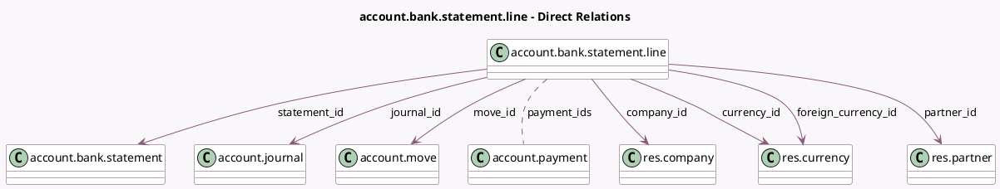

<!-- GENERATED:MODEL -->
---
tags: [odoo, community, generated, model]
---

# account.bank.statement.line

- Module: [[docs/Community Addons/account/account|account]]
- Scope: Community Addons
- Defined in module: yes
- Source files: `models/account_bank_statement_line.py`
- Python classes: `AccountBankStatementLine`
- Description: Bank Statement Line

## Field footprint

- Detected fields: 25
- Field types: `Boolean` x 3, `Char` x 7, `Float` x 1, `Integer` x 1, `Json` x 1, `Many2many` x 1, `Many2one` x 7, `Monetary` x 4
- Relation fields: 8

## Sample fields

- `account_number`: `Char`
- `amount`: `Monetary`
- `amount_currency`: `Monetary` (compute `_compute_amount_currency`, store `True`)
- `amount_residual`: `Float` (compute `_compute_is_reconciled`, store `True`)
- `company_id`: `Many2one` (comodel `res.company`, related `move_id.company_id`, store `True`)
- `country_code`: `Char` (related `company_id.account_fiscal_country_id.code`)
- `currency_id`: `Many2one` (comodel `res.currency`, compute `_compute_currency_id`, store `True`)
- `foreign_currency_id`: `Many2one` (comodel `res.currency`)
- `internal_index`: `Char` (compute `_compute_internal_index`, store `True`)
- `is_reconciled`: `Boolean` (compute `_compute_is_reconciled`, store `True`)
- `journal_id`: `Many2one` (comodel `account.journal`, related `move_id.journal_id`, store `True`)
- `move_id`: `Many2one` (comodel `account.move`)
- `partner_id`: `Many2one` (comodel `res.partner`)
- `partner_name`: `Char`
- `payment_ids`: `Many2many` (comodel `account.payment`)
- `payment_ref`: `Char`
- `running_balance`: `Monetary` (compute `_compute_running_balance`)
- `sequence`: `Integer`
- `statement_balance_end_real`: `Monetary` (related `statement_id.balance_end_real`)
- `statement_complete`: `Boolean` (related `statement_id.is_complete`)

## Method hints

- Detected methods: 23
- Action methods: `action_undo_reconciliation`
- Compute methods: `_compute_amount_currency`, `_compute_currency_id`, `_compute_internal_index`, `_compute_is_reconciled`, `_compute_running_balance`
- Onchange methods: none

## Direct relation diagram

## Navigation

- **Parent:** [[docs/Community Addons/account/Models]]

<!-- GENERATED:MODEL -->
