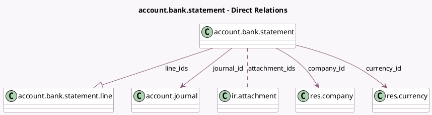

<!-- GENERATED:MODEL -->
---
tags: [odoo, community, generated, model]
---

# account.bank.statement

- Module: [[docs/Community Addons/account/account|account]]
- Scope: Community Addons
- Defined in module: yes
- Source files: `models/account_bank_statement.py`
- Python classes: `AccountBankStatement`
- Description: Bank Statement

## Field footprint

- Detected fields: 15
- Field types: `Boolean` x 2, `Char` x 3, `Date` x 1, `Many2many` x 1, `Many2one` x 3, `Monetary` x 3, `One2many` x 1, `Text` x 1
- Relation fields: 5

## Sample fields

- `attachment_ids`: `Many2many` (comodel `ir.attachment`)
- `balance_end`: `Monetary` (compute `_compute_balance_end`, store `True`)
- `balance_end_real`: `Monetary` (compute `_compute_balance_end_real`, store `True`)
- `balance_start`: `Monetary` (compute `_compute_balance_start`, store `True`)
- `company_id`: `Many2one` (comodel `res.company`, related `journal_id.company_id`, store `True`)
- `currency_id`: `Many2one` (comodel `res.currency`, compute `_compute_currency_id`, store `True`)
- `date`: `Date` (compute `_compute_date_index`, store `True`)
- `first_line_index`: `Char` (comodel `account.bank.statement.line`, compute `_compute_date_index`, store `True`)
- `is_complete`: `Boolean` (compute `_compute_is_complete`, store `True`)
- `is_valid`: `Boolean` (compute `_compute_is_valid`)
- `journal_id`: `Many2one` (comodel `account.journal`, compute `_compute_journal_id`, store `True`)
- `line_ids`: `One2many` (comodel `account.bank.statement.line`)
- `name`: `Char` (compute `_compute_name`, store `True`)
- `problem_description`: `Text` (compute `_compute_problem_description`)
- `reference`: `Char`

## Method hints

- Detected methods: 17
- Action methods: none
- Compute methods: `_compute_balance_end`, `_compute_balance_end_real`, `_compute_balance_start`, `_compute_currency_id`, `_compute_date_index`, `_compute_is_complete`, `_compute_is_valid`, `_compute_journal_id`, and 2 more
- Onchange methods: none

## Direct relation diagram

## Navigation

- **Parent:** [[docs/Community Addons/account/Models]]

<!-- GENERATED:MODEL -->
