<!-- GENERATED:MODEL -->
---
tags: [odoo, community, generated, model]
---

# account.cash.rounding

- Module: [[docs/Community Addons/account/account|account]]
- Scope: Community Addons
- Defined in module: yes
- Source files: `models/account_cash_rounding.py`
- Python classes: `AccountCashRounding`
- Description: Account Cash Rounding

## Field footprint

- Detected fields: 6
- Field types: `Char` x 1, `Float` x 1, `Many2one` x 2, `Selection` x 2
- Relation fields: 2

## Sample fields

- `loss_account_id`: `Many2one` (comodel `account.account`)
- `name`: `Char`
- `profit_account_id`: `Many2one` (comodel `account.account`)
- `rounding`: `Float`
- `rounding_method`: `Selection`
- `strategy`: `Selection`

## Method hints

- Detected methods: 3
- Action methods: none
- Compute methods: none
- Onchange methods: none

## Direct relation diagram

```plantuml
@startuml
!define ODOO_COLOR_PRIMARY #714B67
!define ODOO_COLOR_ACCENT #875A7B
!define ODOO_COLOR_BG #FAF7FA

skinparam backgroundColor ODOO_COLOR_BG
skinparam defaultTextAlignment left
skinparam ArrowColor ODOO_COLOR_ACCENT
skinparam ClassBackgroundColor white
skinparam ClassBorderColor ODOO_COLOR_PRIMARY
skinparam ComponentBackgroundColor white
skinparam ComponentBorderColor ODOO_COLOR_PRIMARY
skinparam NoteBackgroundColor #FFF8FF
skinparam NoteBorderColor ODOO_COLOR_ACCENT
skinparam SequenceLifeLineBorderColor ODOO_COLOR_ACCENT
skinparam SequenceLifeLineBackgroundColor #FFFFFF
skinparam SequenceParticipantBorderColor ODOO_COLOR_PRIMARY
skinparam SequenceParticipantBackgroundColor #FFFFFF
skinparam sequence {
  ArrowColor ODOO_COLOR_ACCENT
  ActorBorderColor ODOO_COLOR_PRIMARY
}
title account.cash.rounding - Direct Relations
class "account.cash.rounding" as account_cash_rounding
class "account.account" as account_account
account_cash_rounding --> account_account : profit_account_id
account_cash_rounding --> account_account : loss_account_id
@enduml
```

## Navigation

- **Parent:** [[docs/Community Addons/account/Models]]

<!-- GENERATED:MODEL -->
