<!-- GENERATED:MODEL -->
---
tags: [odoo, community, generated, model]
---

# account.code.mapping

- Module: [[docs/Community Addons/account/account|account]]
- Scope: Community Addons
- Defined in module: yes
- Source files: `models/account_code_mapping.py`
- Python classes: `AccountCodeMapping`
- Description: Mapping of account codes per company

## Field footprint

- Detected fields: 3
- Field types: `Char` x 1, `Many2one` x 2
- Relation fields: 2

## Sample fields

- `account_id`: `Many2one` (comodel `account.account`, compute `_compute_account_id`)
- `code`: `Char` (compute `_compute_code`)
- `company_id`: `Many2one` (comodel `res.company`, compute `_compute_company_id`)

## Method hints

- Detected methods: 6
- Action methods: none
- Compute methods: `_compute_account_id`, `_compute_code`, `_compute_company_id`
- Onchange methods: none

## Direct relation diagram

```plantuml
@startuml
!define ODOO_COLOR_PRIMARY #714B67
!define ODOO_COLOR_ACCENT #875A7B
!define ODOO_COLOR_BG #FAF7FA

skinparam backgroundColor ODOO_COLOR_BG
skinparam defaultTextAlignment left
skinparam ArrowColor ODOO_COLOR_ACCENT
skinparam ClassBackgroundColor white
skinparam ClassBorderColor ODOO_COLOR_PRIMARY
skinparam ComponentBackgroundColor white
skinparam ComponentBorderColor ODOO_COLOR_PRIMARY
skinparam NoteBackgroundColor #FFF8FF
skinparam NoteBorderColor ODOO_COLOR_ACCENT
skinparam SequenceLifeLineBorderColor ODOO_COLOR_ACCENT
skinparam SequenceLifeLineBackgroundColor #FFFFFF
skinparam SequenceParticipantBorderColor ODOO_COLOR_PRIMARY
skinparam SequenceParticipantBackgroundColor #FFFFFF
skinparam sequence {
  ArrowColor ODOO_COLOR_ACCENT
  ActorBorderColor ODOO_COLOR_PRIMARY
}
title account.code.mapping - Direct Relations
class "account.code.mapping" as account_code_mapping
class "account.account" as account_account
class "res.company" as res_company
account_code_mapping --> account_account : account_id
account_code_mapping --> res_company : company_id
@enduml
```

## Navigation

- **Parent:** [[docs/Community Addons/account/Models]]

<!-- GENERATED:MODEL -->
