<!-- GENERATED:MODEL -->
---
tags: [odoo, community, generated, model]
---

# account.financial.year.op

- Module: [[docs/Community Addons/account/account|account]]
- Scope: Community Addons
- Defined in module: yes
- Source files: `wizard/setup_wizards.py`
- Python classes: `AccountFinancialYearOp`
- Description: Opening Balance of Financial Year

## Field footprint

- Detected fields: 5
- Field types: `Boolean` x 1, `Date` x 1, `Integer` x 1, `Many2one` x 1, `Selection` x 1
- Relation fields: 1

## Sample fields

- `company_id`: `Many2one` (comodel `res.company`)
- `fiscalyear_last_day`: `Integer` (related `company_id.fiscalyear_last_day`)
- `fiscalyear_last_month`: `Selection` (related `company_id.fiscalyear_last_month`)
- `opening_date`: `Date` (related `company_id.account_opening_date`)
- `opening_move_posted`: `Boolean` (compute `_compute_opening_move_posted`)

## Method hints

- Detected methods: 4
- Action methods: `action_save_onboarding_fiscal_year`
- Compute methods: `_compute_opening_move_posted`
- Onchange methods: none

## Direct relation diagram

```plantuml
@startuml
!define ODOO_COLOR_PRIMARY #714B67
!define ODOO_COLOR_ACCENT #875A7B
!define ODOO_COLOR_BG #FAF7FA

skinparam backgroundColor ODOO_COLOR_BG
skinparam defaultTextAlignment left
skinparam ArrowColor ODOO_COLOR_ACCENT
skinparam ClassBackgroundColor white
skinparam ClassBorderColor ODOO_COLOR_PRIMARY
skinparam ComponentBackgroundColor white
skinparam ComponentBorderColor ODOO_COLOR_PRIMARY
skinparam NoteBackgroundColor #FFF8FF
skinparam NoteBorderColor ODOO_COLOR_ACCENT
skinparam SequenceLifeLineBorderColor ODOO_COLOR_ACCENT
skinparam SequenceLifeLineBackgroundColor #FFFFFF
skinparam SequenceParticipantBorderColor ODOO_COLOR_PRIMARY
skinparam SequenceParticipantBackgroundColor #FFFFFF
skinparam sequence {
  ArrowColor ODOO_COLOR_ACCENT
  ActorBorderColor ODOO_COLOR_PRIMARY
}
title account.financial.year.op - Direct Relations
class "account.financial.year.op" as account_financial_year_op
class "res.company" as res_company
account_financial_year_op --> res_company : company_id
@enduml
```

## Navigation

- **Parent:** [[docs/Community Addons/account/Models]]

<!-- GENERATED:MODEL -->
