<!-- GENERATED:MODEL -->
---
tags: [odoo, community, generated, model]
---

# account.fiscal.position.account

- Module: [[docs/Community Addons/account/account|account]]
- Scope: Community Addons
- Defined in module: yes
- Source files: `models/partner.py`
- Python classes: `AccountFiscalPositionAccount`
- Description: Accounts Mapping of Fiscal Position

## Field footprint

- Detected fields: 4
- Field types: `Many2one` x 4
- Relation fields: 4

## Sample fields

- `account_dest_id`: `Many2one` (comodel `account.account`)
- `account_src_id`: `Many2one` (comodel `account.account`)
- `company_id`: `Many2one` (comodel `res.company`, related `position_id.company_id`, store `True`)
- `position_id`: `Many2one` (comodel `account.fiscal.position`)

## Method hints

- Detected methods: 0
- Action methods: none
- Compute methods: none
- Onchange methods: none

## Direct relation diagram

```plantuml
@startuml
!define ODOO_COLOR_PRIMARY #714B67
!define ODOO_COLOR_ACCENT #875A7B
!define ODOO_COLOR_BG #FAF7FA

skinparam backgroundColor ODOO_COLOR_BG
skinparam defaultTextAlignment left
skinparam ArrowColor ODOO_COLOR_ACCENT
skinparam ClassBackgroundColor white
skinparam ClassBorderColor ODOO_COLOR_PRIMARY
skinparam ComponentBackgroundColor white
skinparam ComponentBorderColor ODOO_COLOR_PRIMARY
skinparam NoteBackgroundColor #FFF8FF
skinparam NoteBorderColor ODOO_COLOR_ACCENT
skinparam SequenceLifeLineBorderColor ODOO_COLOR_ACCENT
skinparam SequenceLifeLineBackgroundColor #FFFFFF
skinparam SequenceParticipantBorderColor ODOO_COLOR_PRIMARY
skinparam SequenceParticipantBackgroundColor #FFFFFF
skinparam sequence {
  ArrowColor ODOO_COLOR_ACCENT
  ActorBorderColor ODOO_COLOR_PRIMARY
}
title account.fiscal.position.account - Direct Relations
class "account.fiscal.position.account" as account_fiscal_position_account
class "account.account" as account_account
class "account.fiscal.position" as account_fiscal_position
class "res.company" as res_company
account_fiscal_position_account --> account_fiscal_position : position_id
account_fiscal_position_account --> res_company : company_id
account_fiscal_position_account --> account_account : account_src_id
account_fiscal_position_account --> account_account : account_dest_id
@enduml
```

## Navigation

- **Parent:** [[docs/Community Addons/account/Models]]

<!-- GENERATED:MODEL -->
