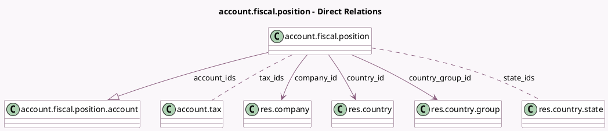

<!-- GENERATED:MODEL -->
---
tags: [odoo, community, generated, model]
---

# account.fiscal.position

- Module: [[docs/Community Addons/account/account|account]]
- Scope: Community Addons
- Defined in module: yes
- Source files: `models/partner.py`
- Python classes: `AccountFiscalPosition`
- Description: Fiscal Position

## Field footprint

- Detected fields: 22
- Field types: `Binary` x 2, `Boolean` x 4, `Char` x 5, `Html` x 1, `Integer` x 2, `Many2many` x 2, `Many2one` x 4, `One2many` x 1, `Selection` x 1
- Relation fields: 7

## Sample fields

- `account_ids`: `One2many` (comodel `account.fiscal.position.account`)
- `account_map`: `Binary` (compute `_compute_account_map`)
- `active`: `Boolean`
- `auto_apply`: `Boolean`
- `company_country_id`: `Many2one` (related `company_id.account_fiscal_country_id`)
- `company_id`: `Many2one` (comodel `res.company`)
- `country_group_id`: `Many2one` (comodel `res.country.group`)
- `country_id`: `Many2one` (comodel `res.country`)
- `fiscal_country_codes`: `Char` (related `company_country_id.code`)
- `foreign_vat`: `Char`
- `foreign_vat_header_mode`: `Selection` (compute `_compute_foreign_vat_header_mode`)
- `is_domestic`: `Boolean` (compute `_compute_is_domestic`, store `True`)
- `name`: `Char`
- `note`: `Html` (comodel `Notes`)
- `sequence`: `Integer`
- `state_ids`: `Many2many` (comodel `res.country.state`)
- `states_count`: `Integer` (compute `_compute_states_count`)
- `tax_ids`: `Many2many` (comodel `account.tax`)
- `tax_map`: `Binary` (compute `_compute_tax_map`)
- `vat_required`: `Boolean`

## Method hints

- Detected methods: 21
- Action methods: `action_create_foreign_taxes`, `action_open_related_taxes`
- Compute methods: `_compute_account_map`, `_compute_foreign_vat_header_mode`, `_compute_is_domestic`, `_compute_states_count`, `_compute_tax_map`
- Onchange methods: `_onchange_country_group_id`, `_onchange_country_id`, `_onchange_foreign_vat`

## Direct relation diagram

## Navigation

- **Parent:** [[docs/Community Addons/account/Models]]

<!-- GENERATED:MODEL -->
