<!-- GENERATED:MODEL -->
---
tags: [odoo, community, generated, model]
---

# account.full.reconcile

- Module: [[docs/Community Addons/account/account|account]]
- Scope: Community Addons
- Defined in module: yes
- Source files: `models/account_full_reconcile.py`
- Python classes: `AccountFullReconcile`
- Description: Full Reconcile

## Field footprint

- Detected fields: 2
- Field types: `One2many` x 2
- Relation fields: 2

## Sample fields

- `partial_reconcile_ids`: `One2many` (comodel `account.partial.reconcile`)
- `reconciled_line_ids`: `One2many` (comodel `account.move.line`)

## Method hints

- Detected methods: 1
- Action methods: none
- Compute methods: none
- Onchange methods: none

## Direct relation diagram

```plantuml
@startuml
!define ODOO_COLOR_PRIMARY #714B67
!define ODOO_COLOR_ACCENT #875A7B
!define ODOO_COLOR_BG #FAF7FA

skinparam backgroundColor ODOO_COLOR_BG
skinparam defaultTextAlignment left
skinparam ArrowColor ODOO_COLOR_ACCENT
skinparam ClassBackgroundColor white
skinparam ClassBorderColor ODOO_COLOR_PRIMARY
skinparam ComponentBackgroundColor white
skinparam ComponentBorderColor ODOO_COLOR_PRIMARY
skinparam NoteBackgroundColor #FFF8FF
skinparam NoteBorderColor ODOO_COLOR_ACCENT
skinparam SequenceLifeLineBorderColor ODOO_COLOR_ACCENT
skinparam SequenceLifeLineBackgroundColor #FFFFFF
skinparam SequenceParticipantBorderColor ODOO_COLOR_PRIMARY
skinparam SequenceParticipantBackgroundColor #FFFFFF
skinparam sequence {
  ArrowColor ODOO_COLOR_ACCENT
  ActorBorderColor ODOO_COLOR_PRIMARY
}
title account.full.reconcile - Direct Relations
class "account.full.reconcile" as account_full_reconcile
class "account.move.line" as account_move_line
class "account.partial.reconcile" as account_partial_reconcile
account_full_reconcile --|> account_partial_reconcile : partial_reconcile_ids
account_full_reconcile --|> account_move_line : reconciled_line_ids
@enduml
```

## Navigation

- **Parent:** [[docs/Community Addons/account/Models]]

<!-- GENERATED:MODEL -->
