<!-- GENERATED:MODEL -->
---
tags: [odoo, community, generated, model]
---

# account.group

- Module: [[docs/Community Addons/account/account|account]]
- Scope: Community Addons
- Defined in module: yes
- Source files: `models/account_account.py`
- Python classes: `AccountGroup`
- Description: Account Group

## Field footprint

- Detected fields: 5
- Field types: `Char` x 3, `Many2one` x 2
- Relation fields: 2

## Sample fields

- `code_prefix_end`: `Char` (compute `_compute_code_prefix_end`, store `True`)
- `code_prefix_start`: `Char` (compute `_compute_code_prefix_start`, store `True`)
- `company_id`: `Many2one` (comodel `res.company`)
- `name`: `Char`
- `parent_id`: `Many2one` (comodel `account.group`)

## Method hints

- Detected methods: 11
- Action methods: none
- Compute methods: `_compute_code_prefix_end`, `_compute_code_prefix_start`, `_compute_display_name`
- Onchange methods: none

## Direct relation diagram

```plantuml
@startuml
!define ODOO_COLOR_PRIMARY #714B67
!define ODOO_COLOR_ACCENT #875A7B
!define ODOO_COLOR_BG #FAF7FA

skinparam backgroundColor ODOO_COLOR_BG
skinparam defaultTextAlignment left
skinparam ArrowColor ODOO_COLOR_ACCENT
skinparam ClassBackgroundColor white
skinparam ClassBorderColor ODOO_COLOR_PRIMARY
skinparam ComponentBackgroundColor white
skinparam ComponentBorderColor ODOO_COLOR_PRIMARY
skinparam NoteBackgroundColor #FFF8FF
skinparam NoteBorderColor ODOO_COLOR_ACCENT
skinparam SequenceLifeLineBorderColor ODOO_COLOR_ACCENT
skinparam SequenceLifeLineBackgroundColor #FFFFFF
skinparam SequenceParticipantBorderColor ODOO_COLOR_PRIMARY
skinparam SequenceParticipantBackgroundColor #FFFFFF
skinparam sequence {
  ArrowColor ODOO_COLOR_ACCENT
  ActorBorderColor ODOO_COLOR_PRIMARY
}
title account.group - Direct Relations
class "account.group" as account_group
class "account.group" as account_group
class "res.company" as res_company
account_group --> account_group : parent_id
account_group --> res_company : company_id
@enduml
```

## Navigation

- **Parent:** [[docs/Community Addons/account/Models]]

<!-- GENERATED:MODEL -->
