<!-- GENERATED:MODEL -->
---
tags: [odoo, community, generated, model]
---

# account.invoice.report

- Module: [[docs/Community Addons/account/account|account]]
- Scope: Community Addons
- Defined in module: yes
- Source files: `report/account_invoice_report.py`
- Python classes: `AccountInvoiceReport`
- Description: Invoices Statistics

## Field footprint

- Detected fields: 27
- Field types: `Date` x 2, `Float` x 8, `Many2one` x 14, `Selection` x 3
- Relation fields: 14

## Sample fields

- `account_id`: `Many2one` (comodel `account.account`)
- `commercial_partner_id`: `Many2one` (comodel `res.partner`)
- `company_currency_id`: `Many2one` (comodel `res.currency`)
- `company_id`: `Many2one` (comodel `res.company`)
- `country_id`: `Many2one` (comodel `res.country`)
- `currency_id`: `Many2one` (comodel `res.currency`)
- `fiscal_position_id`: `Many2one` (comodel `account.fiscal.position`)
- `inventory_value`: `Float`
- `invoice_date`: `Date`
- `invoice_date_due`: `Date`
- `invoice_user_id`: `Many2one` (comodel `res.users`)
- `journal_id`: `Many2one` (comodel `account.journal`)
- `move_id`: `Many2one` (comodel `account.move`)
- `move_type`: `Selection`
- `partner_id`: `Many2one` (comodel `res.partner`)
- `payment_state`: `Selection`
- `price_average`: `Float`
- `price_margin`: `Float`
- `price_subtotal`: `Float`
- `price_subtotal_currency`: `Float`

## Method hints

- Detected methods: 5
- Action methods: none
- Compute methods: none
- Onchange methods: none

## Direct relation diagram

```plantuml
@startuml
!define ODOO_COLOR_PRIMARY #714B67
!define ODOO_COLOR_ACCENT #875A7B
!define ODOO_COLOR_BG #FAF7FA

skinparam backgroundColor ODOO_COLOR_BG
skinparam defaultTextAlignment left
skinparam ArrowColor ODOO_COLOR_ACCENT
skinparam ClassBackgroundColor white
skinparam ClassBorderColor ODOO_COLOR_PRIMARY
skinparam ComponentBackgroundColor white
skinparam ComponentBorderColor ODOO_COLOR_PRIMARY
skinparam NoteBackgroundColor #FFF8FF
skinparam NoteBorderColor ODOO_COLOR_ACCENT
skinparam SequenceLifeLineBorderColor ODOO_COLOR_ACCENT
skinparam SequenceLifeLineBackgroundColor #FFFFFF
skinparam SequenceParticipantBorderColor ODOO_COLOR_PRIMARY
skinparam SequenceParticipantBackgroundColor #FFFFFF
skinparam sequence {
  ArrowColor ODOO_COLOR_ACCENT
  ActorBorderColor ODOO_COLOR_PRIMARY
}
title account.invoice.report - Direct Relations
class "account.invoice.report" as account_invoice_report
class "account.account" as account_account
class "account.fiscal.position" as account_fiscal_position
class "account.journal" as account_journal
class "account.move" as account_move
class "product.category" as product_category
class "product.product" as product_product
class "res.company" as res_company
class "res.country" as res_country
class "res.currency" as res_currency
class "res.partner" as res_partner
class "res.users" as res_users
class "uom.uom" as uom_uom
account_invoice_report --> account_move : move_id
account_invoice_report --> account_journal : journal_id
account_invoice_report --> res_company : company_id
account_invoice_report --> res_currency : company_currency_id
account_invoice_report --> res_partner : partner_id
account_invoice_report --> res_partner : commercial_partner_id
account_invoice_report --> res_country : country_id
account_invoice_report --> res_users : invoice_user_id
account_invoice_report --> account_fiscal_position : fiscal_position_id
account_invoice_report --> product_product : product_id
account_invoice_report --> uom_uom : product_uom_id
account_invoice_report --> product_category : product_categ_id
account_invoice_report --> account_account : account_id
account_invoice_report --> res_currency : currency_id
@enduml
```

## Navigation

- **Parent:** [[docs/Community Addons/account/Models]]

<!-- GENERATED:MODEL -->
