<!-- GENERATED:MODEL -->
---
tags: [odoo, community, generated, model]
---

# account.journal.group

- Module: [[docs/Community Addons/account/account|account]]
- Scope: Community Addons
- Defined in module: yes
- Source files: `models/account_journal.py`
- Python classes: `AccountJournalGroup`
- Description: Account Journal Group

## Field footprint

- Detected fields: 4
- Field types: `Char` x 1, `Integer` x 1, `Many2many` x 1, `Many2one` x 1
- Relation fields: 2

## Sample fields

- `company_id`: `Many2one` (comodel `res.company`)
- `excluded_journal_ids`: `Many2many` (comodel `account.journal`)
- `name`: `Char` (comodel `Ledger group`)
- `sequence`: `Integer`

## Method hints

- Detected methods: 0
- Action methods: none
- Compute methods: none
- Onchange methods: none

## Direct relation diagram

```plantuml
@startuml
!define ODOO_COLOR_PRIMARY #714B67
!define ODOO_COLOR_ACCENT #875A7B
!define ODOO_COLOR_BG #FAF7FA

skinparam backgroundColor ODOO_COLOR_BG
skinparam defaultTextAlignment left
skinparam ArrowColor ODOO_COLOR_ACCENT
skinparam ClassBackgroundColor white
skinparam ClassBorderColor ODOO_COLOR_PRIMARY
skinparam ComponentBackgroundColor white
skinparam ComponentBorderColor ODOO_COLOR_PRIMARY
skinparam NoteBackgroundColor #FFF8FF
skinparam NoteBorderColor ODOO_COLOR_ACCENT
skinparam SequenceLifeLineBorderColor ODOO_COLOR_ACCENT
skinparam SequenceLifeLineBackgroundColor #FFFFFF
skinparam SequenceParticipantBorderColor ODOO_COLOR_PRIMARY
skinparam SequenceParticipantBackgroundColor #FFFFFF
skinparam sequence {
  ArrowColor ODOO_COLOR_ACCENT
  ActorBorderColor ODOO_COLOR_PRIMARY
}
title account.journal.group - Direct Relations
class "account.journal.group" as account_journal_group
class "account.journal" as account_journal
class "res.company" as res_company
account_journal_group --> res_company : company_id
account_journal_group .. account_journal : excluded_journal_ids
@enduml
```

## Navigation

- **Parent:** [[docs/Community Addons/account/Models]]

<!-- GENERATED:MODEL -->
