<!-- GENERATED:MODEL -->
---
tags: [odoo, community, generated, model]
---

# account.journal

- Module: [[docs/Community Addons/account/account|account]]
- Scope: Community Addons
- Defined in module: yes
- Source files: `models/account_journal.py`, `models/account_journal_dashboard.py`
- Python classes: `AccountJournal`
- Description: Journal
- Inherits: `mail.activity.mixin`, `mail.alias.mixin.optional`, `mail.thread`, `portal.mixin`

## Field footprint

- Detected fields: 55
- Field types: `Boolean` x 15, `Char` x 9, `Date` x 1, `Integer` x 3, `Json` x 1, `Many2many` x 2, `Many2one` x 12, `Monetary` x 1, `One2many` x 3, `Selection` x 4, `Text` x 4
- Relation fields: 17

## Sample fields

- `account_fiscal_country_group_codes`: `Json` (related `company_id.account_fiscal_country_group_codes`)
- `accounting_date`: `Date` (compute `_compute_accounting_date`)
- `active`: `Boolean`
- `alias_name`: `Char`
- `available_invoice_template_pdf_report_ids`: `One2many` (comodel `ir.actions.report`, compute `_compute_available_invoice_template_pdf_report_ids`)
- `available_payment_method_ids`: `Many2many` (comodel `account.payment.method`, compute `_compute_available_payment_method_ids`)
- `bank_acc_number`: `Char` (related `bank_account_id.acc_number`)
- `bank_account_id`: `Many2one` (comodel `res.partner.bank`)
- `bank_id`: `Many2one` (comodel `res.bank`, related `bank_account_id.bank_id`)
- `bank_statements_source`: `Selection`
- `code`: `Char` (compute `_compute_code`, store `True`)
- `color`: `Integer` (comodel `Color Index`)
- `company_id`: `Many2one` (comodel `res.company`)
- `company_partner_id`: `Many2one` (comodel `res.partner`, related `company_id.partner_id`, store `False`)
- `country_code`: `Char` (related `company_id.account_fiscal_country_id.code`)
- `currency_id`: `Many2one` (comodel `res.currency`)
- `current_statement_balance`: `Monetary` (compute `_compute_current_statement_balance`)
- `default_account_id`: `Many2one` (comodel `account.account`)
- `default_account_type`: `Char` (compute `_compute_default_account_type`)
- `display_alias_fields`: `Boolean` (compute `_compute_display_alias_fields`)

## Method hints

- Detected methods: 104
- Action methods: `action_configure_bank_journal`, `action_create_new`, `action_create_vendor_bill`, `action_post_all_entries`
- Compute methods: `_compute_accounting_date`, `_compute_available_invoice_template_pdf_report_ids`, `_compute_available_payment_method_ids`, `_compute_code`, `_compute_current_statement_balance`, `_compute_default_account_type`, `_compute_display_alias_fields`, `_compute_display_name`, and 15 more
- Onchange methods: `_onchange_type`

## Direct relation diagram

```plantuml
@startuml
!define ODOO_COLOR_PRIMARY #714B67
!define ODOO_COLOR_ACCENT #875A7B
!define ODOO_COLOR_BG #FAF7FA

skinparam backgroundColor ODOO_COLOR_BG
skinparam defaultTextAlignment left
skinparam ArrowColor ODOO_COLOR_ACCENT
skinparam ClassBackgroundColor white
skinparam ClassBorderColor ODOO_COLOR_PRIMARY
skinparam ComponentBackgroundColor white
skinparam ComponentBorderColor ODOO_COLOR_PRIMARY
skinparam NoteBackgroundColor #FFF8FF
skinparam NoteBorderColor ODOO_COLOR_ACCENT
skinparam SequenceLifeLineBorderColor ODOO_COLOR_ACCENT
skinparam SequenceLifeLineBackgroundColor #FFFFFF
skinparam SequenceParticipantBorderColor ODOO_COLOR_PRIMARY
skinparam SequenceParticipantBackgroundColor #FFFFFF
skinparam sequence {
  ArrowColor ODOO_COLOR_ACCENT
  ActorBorderColor ODOO_COLOR_PRIMARY
}
title account.journal - Direct Relations
class "account.journal" as account_journal
class "account.account" as account_account
class "account.bank.statement" as account_bank_statement
class "account.journal.group" as account_journal_group
class "account.payment.method" as account_payment_method
class "account.payment.method.line" as account_payment_method_line
class "ir.actions.report" as ir_actions_report
class "res.bank" as res_bank
class "res.company" as res_company
class "res.currency" as res_currency
class "res.partner" as res_partner
class "res.partner.bank" as res_partner_bank
account_journal --> account_account : default_account_id
account_journal --> account_account : suspense_account_id
account_journal --> account_account : non_deductible_account_id
account_journal --> res_currency : currency_id
account_journal --> res_company : company_id
account_journal --> ir_actions_report : invoice_template_pdf_report_id
account_journal --|> ir_actions_report : available_invoice_template_pdf_report_ids
account_journal --|> account_payment_method_line : inbound_payment_method_line_ids
account_journal --|> account_payment_method_line : outbound_payment_method_line_ids
account_journal --> account_account : profit_account_id
account_journal --> account_account : loss_account_id
account_journal --> res_partner : company_partner_id
account_journal --> res_partner_bank : bank_account_id
account_journal --> res_bank : bank_id
account_journal .. account_journal_group : journal_group_ids
account_journal .. account_payment_method : available_payment_method_ids
account_journal --> account_bank_statement : last_statement_id
@enduml
```

## Navigation

- **Parent:** [[docs/Community Addons/account/Models]]

<!-- GENERATED:MODEL -->
