<!-- GENERATED:MODEL -->
---
tags: [odoo, community, generated, model]
---

# account.lock_exception

- Module: [[docs/Community Addons/account/account|account]]
- Scope: Community Addons
- Defined in module: yes
- Source files: `models/account_lock_exception.py`
- Python classes: `AccountLock_Exception`
- Description: Account Lock Exception

## Field footprint

- Detected fields: 13
- Field types: `Boolean` x 1, `Char` x 1, `Date` x 6, `Datetime` x 1, `Many2one` x 2, `Selection` x 2
- Relation fields: 2

## Sample fields

- `active`: `Boolean`
- `company_id`: `Many2one` (comodel `res.company`)
- `company_lock_date`: `Date`
- `end_datetime`: `Datetime`
- `fiscalyear_lock_date`: `Date` (compute `_compute_lock_dates`)
- `lock_date`: `Date`
- `lock_date_field`: `Selection`
- `purchase_lock_date`: `Date` (compute `_compute_lock_dates`)
- `reason`: `Char`
- `sale_lock_date`: `Date` (compute `_compute_lock_dates`)
- `state`: `Selection` (compute `_compute_state`)
- `tax_lock_date`: `Date` (compute `_compute_lock_dates`)
- `user_id`: `Many2one` (comodel `res.users`)

## Method hints

- Detected methods: 17
- Action methods: `action_revoke`, `action_show_audit_trail_during_exception`
- Compute methods: `_compute_display_name`, `_compute_lock_dates`, `_compute_state`
- Onchange methods: none

## Direct relation diagram

```plantuml
@startuml
!define ODOO_COLOR_PRIMARY #714B67
!define ODOO_COLOR_ACCENT #875A7B
!define ODOO_COLOR_BG #FAF7FA

skinparam backgroundColor ODOO_COLOR_BG
skinparam defaultTextAlignment left
skinparam ArrowColor ODOO_COLOR_ACCENT
skinparam ClassBackgroundColor white
skinparam ClassBorderColor ODOO_COLOR_PRIMARY
skinparam ComponentBackgroundColor white
skinparam ComponentBorderColor ODOO_COLOR_PRIMARY
skinparam NoteBackgroundColor #FFF8FF
skinparam NoteBorderColor ODOO_COLOR_ACCENT
skinparam SequenceLifeLineBorderColor ODOO_COLOR_ACCENT
skinparam SequenceLifeLineBackgroundColor #FFFFFF
skinparam SequenceParticipantBorderColor ODOO_COLOR_PRIMARY
skinparam SequenceParticipantBackgroundColor #FFFFFF
skinparam sequence {
  ArrowColor ODOO_COLOR_ACCENT
  ActorBorderColor ODOO_COLOR_PRIMARY
}
title account.lock_exception - Direct Relations
class "account.lock_exception" as account_lock_exception
class "res.company" as res_company
class "res.users" as res_users
account_lock_exception --> res_company : company_id
account_lock_exception --> res_users : user_id
@enduml
```

## Navigation

- **Parent:** [[docs/Community Addons/account/Models]]

<!-- GENERATED:MODEL -->
