<!-- GENERATED:MODEL -->
---
tags: [odoo, community, generated, model]
---

# account.merge.wizard.line

- Module: [[docs/Community Addons/account/account|account]]
- Scope: Community Addons
- Defined in module: yes
- Source files: `wizard/account_merge_wizard.py`
- Python classes: `AccountMergeWizardLine`
- Description: Account merge wizard line

## Field footprint

- Detected fields: 9
- Field types: `Boolean` x 2, `Char` x 2, `Integer` x 1, `Many2many` x 1, `Many2one` x 2, `Selection` x 1
- Relation fields: 3

## Sample fields

- `account_has_hashed_entries`: `Boolean` (compute `_compute_account_has_hashed_entries`)
- `account_id`: `Many2one` (comodel `account.account`)
- `company_ids`: `Many2many` (related `account_id.company_ids`)
- `display_type`: `Selection`
- `grouping_key`: `Char`
- `info`: `Char` (compute `_compute_info`)
- `is_selected`: `Boolean`
- `sequence`: `Integer`
- `wizard_id`: `Many2one` (comodel `account.merge.wizard`)

## Method hints

- Detected methods: 5
- Action methods: none
- Compute methods: `_compute_account_has_hashed_entries`, `_compute_info`
- Onchange methods: none

## Direct relation diagram

```plantuml
@startuml
!define ODOO_COLOR_PRIMARY #714B67
!define ODOO_COLOR_ACCENT #875A7B
!define ODOO_COLOR_BG #FAF7FA

skinparam backgroundColor ODOO_COLOR_BG
skinparam defaultTextAlignment left
skinparam ArrowColor ODOO_COLOR_ACCENT
skinparam ClassBackgroundColor white
skinparam ClassBorderColor ODOO_COLOR_PRIMARY
skinparam ComponentBackgroundColor white
skinparam ComponentBorderColor ODOO_COLOR_PRIMARY
skinparam NoteBackgroundColor #FFF8FF
skinparam NoteBorderColor ODOO_COLOR_ACCENT
skinparam SequenceLifeLineBorderColor ODOO_COLOR_ACCENT
skinparam SequenceLifeLineBackgroundColor #FFFFFF
skinparam SequenceParticipantBorderColor ODOO_COLOR_PRIMARY
skinparam SequenceParticipantBackgroundColor #FFFFFF
skinparam sequence {
  ArrowColor ODOO_COLOR_ACCENT
  ActorBorderColor ODOO_COLOR_PRIMARY
}
title account.merge.wizard.line - Direct Relations
class "account.merge.wizard.line" as account_merge_wizard_line
class "account.account" as account_account
class "account.merge.wizard" as account_merge_wizard
account_merge_wizard_line --> account_merge_wizard : wizard_id
account_merge_wizard_line --> account_account : account_id
@enduml
```

## Navigation

- **Parent:** [[docs/Community Addons/account/Models]]

<!-- GENERATED:MODEL -->
