<!-- GENERATED:MODEL -->
---
tags: [odoo, community, generated, model]
---

# account.merge.wizard

- Module: [[docs/Community Addons/account/account|account]]
- Scope: Community Addons
- Defined in module: yes
- Source files: `wizard/account_merge_wizard.py`
- Python classes: `AccountMergeWizard`
- Description: Account merge wizard

## Field footprint

- Detected fields: 4
- Field types: `Boolean` x 2, `Many2many` x 1, `One2many` x 1
- Relation fields: 2

## Sample fields

- `account_ids`: `Many2many` (comodel `account.account`)
- `disable_merge_button`: `Boolean` (compute `_compute_disable_merge_button`)
- `is_group_by_name`: `Boolean`
- `wizard_line_ids`: `One2many` (comodel `account.merge.wizard.line`, compute `_compute_wizard_line_ids`, store `True`)

## Method hints

- Detected methods: 8
- Action methods: `action_merge`
- Compute methods: `_compute_disable_merge_button`, `_compute_wizard_line_ids`
- Onchange methods: none

## Direct relation diagram

```plantuml
@startuml
!define ODOO_COLOR_PRIMARY #714B67
!define ODOO_COLOR_ACCENT #875A7B
!define ODOO_COLOR_BG #FAF7FA

skinparam backgroundColor ODOO_COLOR_BG
skinparam defaultTextAlignment left
skinparam ArrowColor ODOO_COLOR_ACCENT
skinparam ClassBackgroundColor white
skinparam ClassBorderColor ODOO_COLOR_PRIMARY
skinparam ComponentBackgroundColor white
skinparam ComponentBorderColor ODOO_COLOR_PRIMARY
skinparam NoteBackgroundColor #FFF8FF
skinparam NoteBorderColor ODOO_COLOR_ACCENT
skinparam SequenceLifeLineBorderColor ODOO_COLOR_ACCENT
skinparam SequenceLifeLineBackgroundColor #FFFFFF
skinparam SequenceParticipantBorderColor ODOO_COLOR_PRIMARY
skinparam SequenceParticipantBackgroundColor #FFFFFF
skinparam sequence {
  ArrowColor ODOO_COLOR_ACCENT
  ActorBorderColor ODOO_COLOR_PRIMARY
}
title account.merge.wizard - Direct Relations
class "account.merge.wizard" as account_merge_wizard
class "account.account" as account_account
class "account.merge.wizard.line" as account_merge_wizard_line
account_merge_wizard .. account_account : account_ids
account_merge_wizard --|> account_merge_wizard_line : wizard_line_ids
@enduml
```

## Navigation

- **Parent:** [[docs/Community Addons/account/Models]]

<!-- GENERATED:MODEL -->
