<!-- GENERATED:MODEL -->
---
tags: [odoo, community, generated, model]
---

# account.move.line

- Module: [[docs/Community Addons/account/account|account]]
- Scope: Community Addons
- Defined in module: yes
- Source files: `models/account_move_line.py`, `models/account_move_line_tax_details.py`
- Python classes: `AccountMoveLine`
- Description: Journal Item
- Inherits: `analytic.mixin`

## Field footprint

- Detected fields: 85
- Field types: `Binary` x 5, `Boolean` x 11, `Char` x 6, `Date` x 5, `Float` x 5, `Integer` x 1, `Json` x 2, `Many2many` x 5, `Many2one` x 24, `Monetary` x 12, `One2many` x 3, `Selection` x 6
- Relation fields: 32

## Sample fields

- `account_code`: `Char` (related `account_id.code`)
- `account_id`: `Many2one` (comodel `account.account`, compute `_compute_account_id`, store `True`)
- `account_internal_group`: `Selection` (related `account_id.internal_group`)
- `account_name`: `Char` (related `account_id.name`)
- `account_root_id`: `Many2one` (related `account_id.root_id`)
- `account_type`: `Selection` (related `account_id.account_type`)
- `allowed_uom_ids`: `Many2many` (comodel `uom.uom`, compute `_compute_allowed_uom_ids`)
- `amount_currency`: `Monetary` (compute `_compute_amount_currency`, store `True`)
- `amount_residual`: `Monetary` (compute `_compute_amount_residual`, store `True`)
- `amount_residual_currency`: `Monetary` (compute `_compute_amount_residual`, store `True`)
- `analytic_distribution`: `Json`
- `analytic_line_ids`: `One2many` (comodel `account.analytic.line`)
- `balance`: `Monetary` (compute `_compute_balance`, store `True`)
- `collapse_composition`: `Boolean`
- `collapse_prices`: `Boolean`
- `commercial_partner_country`: `Many2one` (related `move_id.commercial_partner_id.country_id`)
- `company_currency_id`: `Many2one` (related `move_id.company_currency_id`, store `True`)
- `company_id`: `Many2one` (related `move_id.company_id`, store `True`)
- `credit`: `Monetary` (compute `_compute_debit_credit`, store `True`)
- `cumulated_balance`: `Monetary` (compute `_compute_cumulated_balance`)

## Method hints

- Detected methods: 143
- Action methods: `action_add_from_catalog`, `action_automatic_entry`, `action_open_business_doc`, `action_payment_items_register_payment`, `action_register_payment`, `action_unreconcile_match_entries`
- Compute methods: `_compute_account_id`, `_compute_allowed_uom_ids`, `_compute_amount_currency`, `_compute_amount_residual`, `_compute_analytic_distribution`, `_compute_balance`, `_compute_cumulated_balance`, `_compute_currency_id`, and 25 more
- Onchange methods: `_inverse_account_id`, `_inverse_amount_currency`, `_inverse_credit`, `_inverse_debit`, `_inverse_partner_id`, `_inverse_product_id`

## Direct relation diagram

```plantuml
@startuml
!define ODOO_COLOR_PRIMARY #714B67
!define ODOO_COLOR_ACCENT #875A7B
!define ODOO_COLOR_BG #FAF7FA

skinparam backgroundColor ODOO_COLOR_BG
skinparam defaultTextAlignment left
skinparam ArrowColor ODOO_COLOR_ACCENT
skinparam ClassBackgroundColor white
skinparam ClassBorderColor ODOO_COLOR_PRIMARY
skinparam ComponentBackgroundColor white
skinparam ComponentBorderColor ODOO_COLOR_PRIMARY
skinparam NoteBackgroundColor #FFF8FF
skinparam NoteBorderColor ODOO_COLOR_ACCENT
skinparam SequenceLifeLineBorderColor ODOO_COLOR_ACCENT
skinparam SequenceLifeLineBackgroundColor #FFFFFF
skinparam SequenceParticipantBorderColor ODOO_COLOR_PRIMARY
skinparam SequenceParticipantBackgroundColor #FFFFFF
skinparam sequence {
  ArrowColor ODOO_COLOR_ACCENT
  ActorBorderColor ODOO_COLOR_PRIMARY
}
title account.move.line - Direct Relations
class "account.move.line" as account_move_line
class "account.account" as account_account
class "account.account.tag" as account_account_tag
class "account.analytic.line" as account_analytic_line
class "account.bank.statement.line" as account_bank_statement_line
class "account.full.reconcile" as account_full_reconcile
class "account.journal.group" as account_journal_group
class "account.move" as account_move
class "account.move.line" as account_move_line
class "account.partial.reconcile" as account_partial_reconcile
class "account.payment" as account_payment
class "account.reconcile.model" as account_reconcile_model
class "account.tax" as account_tax
account_move_line --> account_move : move_id
account_move_line --> account_journal_group : journal_group_id
account_move_line --> account_account : account_id
account_move_line --> account_account : search_account_id
account_move_line --> res_currency : currency_id
account_move_line --> res_partner : partner_id
account_move_line --> account_reconcile_model : reconcile_model_id
account_move_line --> account_payment : payment_id
account_move_line --> account_bank_statement_line : statement_line_id
account_move_line .. account_tax : tax_ids
account_move_line --> account_tax : group_tax_id
account_move_line --> account_tax : tax_line_id
@enduml
```

## Navigation

- **Parent:** [[docs/Community Addons/account/Models]]

<!-- GENERATED:MODEL -->
