<!-- GENERATED:MODEL -->
---
tags: [odoo, community, generated, model]
---

# account.move

- Module: [[docs/Community Addons/account/account|account]]
- Scope: Community Addons
- Defined in module: yes
- Source files: `models/account_bank_statement_line.py`, `models/account_move.py`, `models/account_payment.py`
- Python classes: `AccountMove`
- Description: Journal Entry
- Inherits: `account.document.import.mixin`, `mail.activity.mixin`, `mail.thread.main.attachment`, `portal.mixin`, `product.catalog.mixin`, `sequence.mixin`

## Field footprint

- Detected fields: 140
- Field types: `Binary` x 6, `Boolean` x 30, `Char` x 19, `Date` x 7, `Float` x 2, `Html` x 2, `Integer` x 5, `Json` x 4, `Many2many` x 5, `Many2one` x 27, `Monetary` x 11, `One2many` x 10, `Selection` x 9, `Text` x 3
- Relation fields: 42

## Sample fields

- `abnormal_amount_warning`: `Text` (compute `_compute_abnormal_warnings`)
- `abnormal_date_warning`: `Text` (compute `_compute_abnormal_warnings`)
- `account_fiscal_country_group_codes`: `Json` (related `company_id.account_fiscal_country_group_codes`)
- `adjusting_entries_count`: `Integer` (compute `_compute_adjusting_entries_count`)
- `adjusting_entries_move_ids`: `Many2many` (comodel `account.move`)
- `adjusting_entry_origin_label`: `Char` (compute `_compute_adjusting_entry_origin_label`)
- `adjusting_entry_origin_move_ids`: `Many2many` (comodel `account.move`)
- `adjusting_entry_origin_moves_count`: `Integer` (compute `_compute_adjusting_entry_origin_moves_count`)
- `alerts`: `Json` (compute `_compute_alerts`)
- `always_tax_exigible`: `Boolean` (compute `_compute_always_tax_exigible`, store `True`)
- `amount_residual`: `Monetary` (compute `_compute_amount`, store `True`)
- `amount_residual_signed`: `Monetary` (compute `_compute_amount`, store `True`)
- `amount_tax`: `Monetary` (compute `_compute_amount`, store `True`)
- `amount_tax_signed`: `Monetary` (compute `_compute_amount`, store `True`)
- `amount_total`: `Monetary` (compute `_compute_amount`, store `True`)
- `amount_total_in_currency_signed`: `Monetary` (compute `_compute_amount`, store `True`)
- `amount_total_signed`: `Monetary` (compute `_compute_amount`, store `True`)
- `amount_total_words`: `Char` (compute `_compute_amount_total_words`)
- `amount_untaxed`: `Monetary` (compute `_compute_amount`, store `True`)
- `amount_untaxed_in_currency_signed`: `Monetary` (compute `_compute_amount`, store `True`)

## Method hints

- Detected methods: 336
- Action methods: `action_activate_currency`, `action_add_from_catalog`, `action_duplicate`, `action_force_register_payment`, `action_invoice_download_pdf`, `action_invoice_sent`, `action_open_business_doc`, `action_post`, and 8 more
- Compute methods: `_compute_abnormal_warnings`, `_compute_access_url`, `_compute_adjusting_entries_count`, `_compute_adjusting_entry_origin_label`, `_compute_adjusting_entry_origin_moves_count`, `_compute_alerts`, `_compute_always_tax_exigible`, `_compute_amount`, and 71 more
- Onchange methods: `_inverse_company_id`, `_inverse_currency_id`, `_inverse_invoice_payment_term_id`, `_inverse_journal_id`, `_inverse_partner_id`, `_inverse_payment_reference`, `_onchange_date`, `_onchange_fpos_id_show_update_fpos`, and 8 more

## Direct relation diagram

```plantuml
@startuml
!define ODOO_COLOR_PRIMARY #714B67
!define ODOO_COLOR_ACCENT #875A7B
!define ODOO_COLOR_BG #FAF7FA

skinparam backgroundColor ODOO_COLOR_BG
skinparam defaultTextAlignment left
skinparam ArrowColor ODOO_COLOR_ACCENT
skinparam ClassBackgroundColor white
skinparam ClassBorderColor ODOO_COLOR_PRIMARY
skinparam ComponentBackgroundColor white
skinparam ComponentBorderColor ODOO_COLOR_PRIMARY
skinparam NoteBackgroundColor #FFF8FF
skinparam NoteBorderColor ODOO_COLOR_ACCENT
skinparam SequenceLifeLineBorderColor ODOO_COLOR_ACCENT
skinparam SequenceLifeLineBackgroundColor #FFFFFF
skinparam SequenceParticipantBorderColor ODOO_COLOR_PRIMARY
skinparam SequenceParticipantBackgroundColor #FFFFFF
skinparam sequence {
  ArrowColor ODOO_COLOR_ACCENT
  ActorBorderColor ODOO_COLOR_PRIMARY
}
title account.move - Direct Relations
class "account.move" as account_move
class "account.bank.statement.line" as account_bank_statement_line
class "account.cash.rounding" as account_cash_rounding
class "account.fiscal.position" as account_fiscal_position
class "account.incoterms" as account_incoterms
class "account.journal" as account_journal
class "account.journal.group" as account_journal_group
class "account.move" as account_move
class "account.move.line" as account_move_line
class "account.partial.reconcile" as account_partial_reconcile
class "account.payment" as account_payment
class "account.payment.method.line" as account_payment_method_line
class "account.payment.term" as account_payment_term
account_move --|> account_bank_statement_line : statement_line_ids
account_move --> account_journal : journal_id
account_move --> account_journal_group : journal_group_id
account_move --> res_company : company_id
account_move --|> account_move_line : line_ids
account_move --|> account_move_line : journal_line_ids
account_move --|> account_partial_reconcile : exchange_diff_partial_ids
account_move --> account_payment : origin_payment_id
account_move .. account_payment : matched_payment_ids
account_move --> account_bank_statement_line : statement_line_id
account_move .. account_move : adjusting_entry_origin_move_ids
account_move .. account_move : adjusting_entries_move_ids
account_move --> account_partial_reconcile : tax_cash_basis_rec_id
account_move --> account_move : tax_cash_basis_origin_move_id
account_move --|> account_move : tax_cash_basis_created_move_ids
account_move --> account_move : auto_post_origin_id
account_move .. account_journal : suitable_journal_ids
@enduml
```

## Navigation

- **Parent:** [[docs/Community Addons/account/Models]]

<!-- GENERATED:MODEL -->
