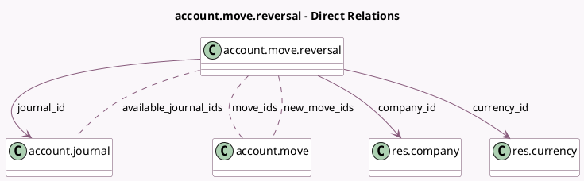

<!-- GENERATED:MODEL -->
---
tags: [odoo, community, generated, model]
---

# account.move.reversal

- Module: [[docs/Community Addons/account/account|account]]
- Scope: Community Addons
- Defined in module: yes
- Source files: `wizard/account_move_reversal.py`
- Python classes: `AccountMoveReversal`
- Description: Account Move Reversal

## Field footprint

- Detected fields: 11
- Field types: `Char` x 3, `Date` x 1, `Many2many` x 3, `Many2one` x 3, `Monetary` x 1
- Relation fields: 6

## Sample fields

- `available_journal_ids`: `Many2many` (comodel `account.journal`, compute `_compute_available_journal_ids`)
- `company_id`: `Many2one` (comodel `res.company`)
- `country_code`: `Char` (related `company_id.country_id.code`)
- `currency_id`: `Many2one` (comodel `res.currency`, compute `_compute_from_moves`)
- `date`: `Date`
- `journal_id`: `Many2one` (comodel `account.journal`, compute `_compute_journal_id`, store `True`)
- `move_ids`: `Many2many` (comodel `account.move`)
- `move_type`: `Char` (compute `_compute_from_moves`)
- `new_move_ids`: `Many2many` (comodel `account.move`)
- `reason`: `Char`
- `residual`: `Monetary` (compute `_compute_from_moves`)

## Method hints

- Detected methods: 10
- Action methods: none
- Compute methods: `_compute_available_journal_ids`, `_compute_from_moves`, `_compute_journal_id`
- Onchange methods: none

## Direct relation diagram

## Navigation

- **Parent:** [[docs/Community Addons/account/Models]]

<!-- GENERATED:MODEL -->
