<!-- GENERATED:MODEL -->
---
tags: [odoo, community, generated, model]
---

# account.move.send.batch.wizard

- Module: [[docs/Community Addons/account/account|account]]
- Scope: Community Addons
- Defined in module: yes
- Source files: `wizard/account_move_send_batch_wizard.py`
- Python classes: `AccountMoveSendBatchWizard`
- Description: Account Move Send Batch Wizard
- Inherits: `account.move.send`

## Field footprint

- Detected fields: 3
- Field types: `Json` x 2, `Many2many` x 1
- Relation fields: 1

## Sample fields

- `alerts`: `Json` (compute `_compute_alerts`)
- `move_ids`: `Many2many` (comodel `account.move`)
- `summary_data`: `Json` (compute `_compute_summary_data`)

## Method hints

- Detected methods: 5
- Action methods: `action_send_and_print`
- Compute methods: `_compute_alerts`, `_compute_summary_data`
- Onchange methods: none

## Direct relation diagram

```plantuml
@startuml
!define ODOO_COLOR_PRIMARY #714B67
!define ODOO_COLOR_ACCENT #875A7B
!define ODOO_COLOR_BG #FAF7FA

skinparam backgroundColor ODOO_COLOR_BG
skinparam defaultTextAlignment left
skinparam ArrowColor ODOO_COLOR_ACCENT
skinparam ClassBackgroundColor white
skinparam ClassBorderColor ODOO_COLOR_PRIMARY
skinparam ComponentBackgroundColor white
skinparam ComponentBorderColor ODOO_COLOR_PRIMARY
skinparam NoteBackgroundColor #FFF8FF
skinparam NoteBorderColor ODOO_COLOR_ACCENT
skinparam SequenceLifeLineBorderColor ODOO_COLOR_ACCENT
skinparam SequenceLifeLineBackgroundColor #FFFFFF
skinparam SequenceParticipantBorderColor ODOO_COLOR_PRIMARY
skinparam SequenceParticipantBackgroundColor #FFFFFF
skinparam sequence {
  ArrowColor ODOO_COLOR_ACCENT
  ActorBorderColor ODOO_COLOR_PRIMARY
}
title account.move.send.batch.wizard - Direct Relations
class "account.move.send.batch.wizard" as account_move_send_batch_wizard
class "account.move" as account_move
account_move_send_batch_wizard .. account_move : move_ids
@enduml
```

## Navigation

- **Parent:** [[docs/Community Addons/account/Models]]

<!-- GENERATED:MODEL -->
