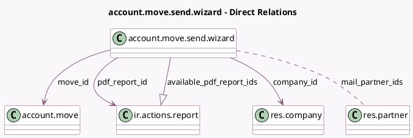

<!-- GENERATED:MODEL -->
---
tags: [odoo, community, generated, model]
---

# account.move.send.wizard

- Module: [[docs/Community Addons/account/account|account]]
- Scope: Community Addons
- Defined in module: yes
- Source files: `wizard/account_move_send_wizard.py`
- Python classes: `AccountMoveSendWizard`
- Description: Account Move Send Wizard
- Inherits: `account.move.send`, `mail.composer.mixin`

## Field footprint

- Detected fields: 18
- Field types: `Boolean` x 1, `Char` x 3, `Json` x 6, `Many2many` x 1, `Many2one` x 4, `One2many` x 1, `Selection` x 1, `Text` x 1
- Relation fields: 6

## Sample fields

- `alerts`: `Json` (compute `_compute_alerts`)
- `available_pdf_report_ids`: `One2many` (comodel `ir.actions.report`, compute `_compute_available_pdf_report_ids`)
- `company_id`: `Many2one` (comodel `res.company`, related `move_id.company_id`)
- `display_pdf_report_id`: `Boolean` (compute `_compute_display_pdf_report_id`)
- `extra_edi_checkboxes`: `Json` (compute `_compute_extra_edi_checkboxes`, store `True`)
- `extra_edis`: `Json` (compute `_compute_extra_edis`)
- `invoice_edi_format`: `Selection` (compute `_compute_invoice_edi_format`)
- `lang`: `Char` (compute `_compute_lang`)
- `mail_attachments_widget`: `Json` (compute `_compute_mail_attachments_widget`, store `True`)
- `mail_partner_ids`: `Many2many` (comodel `res.partner`, compute `_compute_mail_partners`, store `True`)
- `model`: `Char` (comodel `Related Document Model`, compute `_compute_model`, store `True`)
- `move_id`: `Many2one` (comodel `account.move`)
- `pdf_report_id`: `Many2one` (comodel `ir.actions.report`, compute `_compute_pdf_report_id`, store `True`)
- `res_ids`: `Text` (comodel `Related Document IDs`, compute `_compute_res_ids`, store `True`)
- `sending_method_checkboxes`: `Json` (compute `_compute_sending_method_checkboxes`, store `True`)
- `sending_methods`: `Json` (compute `_compute_sending_methods`)
- `template_id`: `Many2one` (compute `_compute_template_id`, store `True`)
- `template_name`: `Char` (comodel `Template Name`)

## Method hints

- Detected methods: 31
- Action methods: `action_send_and_print`
- Compute methods: `_compute_alerts`, `_compute_available_pdf_report_ids`, `_compute_body`, `_compute_can_edit_body`, `_compute_display_pdf_report_id`, `_compute_extra_edi_checkboxes`, `_compute_extra_edis`, `_compute_invoice_edi_format`, and 11 more
- Onchange methods: none

## Direct relation diagram

## Navigation

- **Parent:** [[docs/Community Addons/account/Models]]

<!-- GENERATED:MODEL -->
