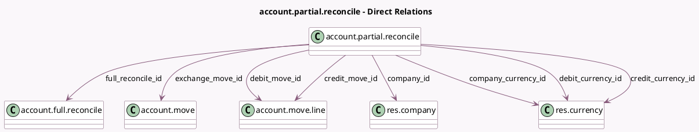

<!-- GENERATED:MODEL -->
---
tags: [odoo, community, generated, model]
---

# account.partial.reconcile

- Module: [[docs/Community Addons/account/account|account]]
- Scope: Community Addons
- Defined in module: yes
- Source files: `models/account_partial_reconcile.py`
- Python classes: `AccountPartialReconcile`
- Description: Partial Reconcile

## Field footprint

- Detected fields: 13
- Field types: `Date` x 1, `Json` x 1, `Many2one` x 8, `Monetary` x 3
- Relation fields: 8

## Sample fields

- `amount`: `Monetary`
- `company_currency_id`: `Many2one` (comodel `res.currency`, related `company_id.currency_id`)
- `company_id`: `Many2one` (comodel `res.company`, compute `_compute_company_id`, store `True`)
- `credit_amount_currency`: `Monetary`
- `credit_currency_id`: `Many2one` (comodel `res.currency`, related `credit_move_id.currency_id`, store `True`)
- `credit_move_id`: `Many2one` (comodel `account.move.line`)
- `debit_amount_currency`: `Monetary`
- `debit_currency_id`: `Many2one` (comodel `res.currency`, related `debit_move_id.currency_id`, store `True`)
- `debit_move_id`: `Many2one` (comodel `account.move.line`)
- `draft_caba_move_vals`: `Json`
- `exchange_move_id`: `Many2one` (comodel `account.move`)
- `full_reconcile_id`: `Many2one` (comodel `account.full.reconcile`)
- `max_date`: `Date` (compute `_compute_max_date`, store `True`)

## Method hints

- Detected methods: 19
- Action methods: none
- Compute methods: `_compute_company_id`, `_compute_max_date`
- Onchange methods: none

## Direct relation diagram

## Navigation

- **Parent:** [[docs/Community Addons/account/Models]]

<!-- GENERATED:MODEL -->
