<!-- GENERATED:MODEL -->
---
tags: [odoo, community, generated, model]
---

# account.payment

- Module: [[docs/Community Addons/account/account|account]]
- Scope: Community Addons
- Defined in module: yes
- Source files: `models/account_payment.py`
- Python classes: `AccountPayment`
- Description: Payments
- Inherits: `mail.activity.mixin`, `mail.thread.main.attachment`

## Field footprint

- Detected fields: 45
- Field types: `Boolean` x 6, `Char` x 6, `Date` x 1, `Html` x 1, `Integer` x 3, `Many2many` x 8, `Many2one` x 12, `Monetary` x 3, `One2many` x 1, `Selection` x 4
- Relation fields: 21

## Sample fields

- `amount`: `Monetary`
- `amount_company_currency_signed`: `Monetary` (compute `_compute_amount_company_currency_signed`, store `True`)
- `amount_signed`: `Monetary` (compute `_compute_amount_signed`)
- `attachment_ids`: `One2many` (comodel `ir.attachment`)
- `available_journal_ids`: `Many2many` (comodel `account.journal`, compute `_compute_available_journal_ids`)
- `available_partner_bank_ids`: `Many2many` (comodel `res.partner.bank`, compute `_compute_available_partner_bank_ids`)
- `available_payment_method_line_ids`: `Many2many` (comodel `account.payment.method.line`, compute `_compute_payment_method_line_fields`)
- `company_currency_id`: `Many2one` (related `company_id.currency_id`)
- `company_id`: `Many2one` (comodel `res.company`, compute `_compute_company_id`, store `True`)
- `country_code`: `Char` (related `company_id.account_fiscal_country_id.code`)
- `currency_id`: `Many2one` (comodel `res.currency`, compute `_compute_currency_id`, store `True`)
- `date`: `Date`
- `destination_account_id`: `Many2one` (comodel `account.account`, compute `_compute_destination_account_id`, store `True`)
- `duplicate_payment_ids`: `Many2many` (comodel `account.payment`, compute `_compute_duplicate_payment_ids`)
- `invoice_ids`: `Many2many` (comodel `account.move`)
- `is_matched`: `Boolean` (compute `_compute_reconciliation_status`, store `True`)
- `is_reconciled`: `Boolean` (compute `_compute_reconciliation_status`, store `True`)
- `is_sent`: `Boolean`
- `journal_id`: `Many2one` (comodel `account.journal`, compute `_compute_journal_id`, store `True`)
- `memo`: `Char`

## Method hints

- Detected methods: 56
- Action methods: `action_cancel`, `action_draft`, `action_open_business_doc`, `action_post`, `action_reject`, `action_validate`
- Compute methods: `_compute_amount_company_currency_signed`, `_compute_amount_signed`, `_compute_available_journal_ids`, `_compute_available_partner_bank_ids`, `_compute_company_id`, `_compute_currency_id`, `_compute_destination_account_id`, `_compute_display_name`, and 13 more
- Onchange methods: none

## Direct relation diagram

```plantuml
@startuml
!define ODOO_COLOR_PRIMARY #714B67
!define ODOO_COLOR_ACCENT #875A7B
!define ODOO_COLOR_BG #FAF7FA

skinparam backgroundColor ODOO_COLOR_BG
skinparam defaultTextAlignment left
skinparam ArrowColor ODOO_COLOR_ACCENT
skinparam ClassBackgroundColor white
skinparam ClassBorderColor ODOO_COLOR_PRIMARY
skinparam ComponentBackgroundColor white
skinparam ComponentBorderColor ODOO_COLOR_PRIMARY
skinparam NoteBackgroundColor #FFF8FF
skinparam NoteBorderColor ODOO_COLOR_ACCENT
skinparam SequenceLifeLineBorderColor ODOO_COLOR_ACCENT
skinparam SequenceLifeLineBackgroundColor #FFFFFF
skinparam SequenceParticipantBorderColor ODOO_COLOR_PRIMARY
skinparam SequenceParticipantBackgroundColor #FFFFFF
skinparam sequence {
  ArrowColor ODOO_COLOR_ACCENT
  ActorBorderColor ODOO_COLOR_PRIMARY
}
title account.payment - Direct Relations
class "account.payment" as account_payment
class "account.account" as account_account
class "account.bank.statement.line" as account_bank_statement_line
class "account.journal" as account_journal
class "account.move" as account_move
class "account.payment" as account_payment
class "account.payment.method.line" as account_payment_method_line
class "ir.attachment" as ir_attachment
class "res.company" as res_company
class "res.currency" as res_currency
class "res.partner" as res_partner
class "res.partner.bank" as res_partner_bank
account_payment --> account_move : move_id
account_payment --> account_journal : journal_id
account_payment --> res_company : company_id
account_payment .. res_partner_bank : available_partner_bank_ids
account_payment --> res_partner_bank : partner_bank_id
account_payment --> account_payment : paired_internal_transfer_payment_id
account_payment --> account_payment_method_line : payment_method_line_id
account_payment .. account_payment_method_line : available_payment_method_line_ids
account_payment .. account_journal : available_journal_ids
account_payment --> res_currency : currency_id
account_payment --> res_partner : partner_id
account_payment --> account_account : outstanding_account_id
account_payment --> account_account : destination_account_id
account_payment .. account_move : invoice_ids
account_payment .. account_move : reconciled_invoice_ids
account_payment .. account_move : reconciled_bill_ids
@enduml
```

## Navigation

- **Parent:** [[docs/Community Addons/account/Models]]

<!-- GENERATED:MODEL -->
