<!-- GENERATED:MODEL -->
---
tags: [odoo, community, generated, model]
---

# account.payment.method.line

- Module: [[docs/Community Addons/account/account|account]]
- Scope: Community Addons
- Defined in module: yes
- Source files: `models/account_payment_method.py`
- Python classes: `AccountPaymentMethodLine`
- Description: Payment Methods

## Field footprint

- Detected fields: 10
- Field types: `Char` x 2, `Integer` x 1, `Many2many` x 1, `Many2one` x 5, `Selection` x 1
- Relation fields: 6

## Sample fields

- `available_payment_method_ids`: `Many2many` (related `journal_id.available_payment_method_ids`)
- `code`: `Char` (related `payment_method_id.code`)
- `company_id`: `Many2one` (related `journal_id.company_id`)
- `default_account_id`: `Many2one` (related `journal_id.default_account_id`)
- `journal_id`: `Many2one` (comodel `account.journal`)
- `name`: `Char` (compute `_compute_name`, store `True`)
- `payment_account_id`: `Many2one` (comodel `account.account`)
- `payment_method_id`: `Many2one` (comodel `account.payment.method`)
- `payment_type`: `Selection` (related `payment_method_id.payment_type`)
- `sequence`: `Integer`

## Method hints

- Detected methods: 7
- Action methods: none
- Compute methods: `_compute_display_name`, `_compute_name`
- Onchange methods: none

## Direct relation diagram

```plantuml
@startuml
!define ODOO_COLOR_PRIMARY #714B67
!define ODOO_COLOR_ACCENT #875A7B
!define ODOO_COLOR_BG #FAF7FA

skinparam backgroundColor ODOO_COLOR_BG
skinparam defaultTextAlignment left
skinparam ArrowColor ODOO_COLOR_ACCENT
skinparam ClassBackgroundColor white
skinparam ClassBorderColor ODOO_COLOR_PRIMARY
skinparam ComponentBackgroundColor white
skinparam ComponentBorderColor ODOO_COLOR_PRIMARY
skinparam NoteBackgroundColor #FFF8FF
skinparam NoteBorderColor ODOO_COLOR_ACCENT
skinparam SequenceLifeLineBorderColor ODOO_COLOR_ACCENT
skinparam SequenceLifeLineBackgroundColor #FFFFFF
skinparam SequenceParticipantBorderColor ODOO_COLOR_PRIMARY
skinparam SequenceParticipantBackgroundColor #FFFFFF
skinparam sequence {
  ArrowColor ODOO_COLOR_ACCENT
  ActorBorderColor ODOO_COLOR_PRIMARY
}
title account.payment.method.line - Direct Relations
class "account.payment.method.line" as account_payment_method_line
class "account.account" as account_account
class "account.journal" as account_journal
class "account.payment.method" as account_payment_method
account_payment_method_line --> account_payment_method : payment_method_id
account_payment_method_line --> account_account : payment_account_id
account_payment_method_line --> account_journal : journal_id
@enduml
```

## Navigation

- **Parent:** [[docs/Community Addons/account/Models]]

<!-- GENERATED:MODEL -->
