<!-- GENERATED:MODEL -->
---
tags: [odoo, community, generated, model]
---

# account.payment.register

- Module: [[docs/Community Addons/account/account|account]]
- Scope: Community Addons
- Defined in module: yes
- Source files: `wizard/account_payment_register.py`
- Python classes: `AccountPaymentRegister`
- Description: Pay

## Field footprint

- Detected fields: 47
- Field types: `Binary` x 1, `Boolean` x 10, `Char` x 3, `Date` x 1, `Html` x 2, `Integer` x 2, `Json` x 1, `Many2many` x 7, `Many2one` x 10, `Monetary` x 6, `Selection` x 4
- Relation fields: 17

## Sample fields

- `actionable_errors`: `Json` (compute `_compute_actionable_errors`)
- `amount`: `Monetary` (compute `_compute_amount`, store `True`)
- `available_journal_ids`: `Many2many` (comodel `account.journal`, compute `_compute_available_journal_ids`)
- `available_partner_bank_ids`: `Many2many` (comodel `res.partner.bank`, compute `_compute_available_partner_bank_ids`)
- `available_payment_method_line_ids`: `Many2many` (comodel `account.payment.method.line`, compute `_compute_payment_method_line_fields`)
- `batches`: `Binary` (compute `_compute_batches`)
- `can_edit_wizard`: `Boolean` (compute `_compute_from_lines`, store `True`)
- `can_group_payments`: `Boolean` (compute `_compute_can_group_payments`, store `True`)
- `communication`: `Char` (compute `_compute_communication`, store `True`)
- `company_currency_id`: `Many2one` (comodel `res.currency`, related `company_id.currency_id`)
- `company_id`: `Many2one` (comodel `res.company`, compute `_compute_from_lines`, store `True`)
- `country_code`: `Char` (related `company_id.account_fiscal_country_id.code`)
- `currency_id`: `Many2one` (comodel `res.currency`, compute `_compute_currency_id`, store `True`)
- `custom_user_amount`: `Monetary`
- `custom_user_currency_id`: `Many2one` (comodel `res.currency`)
- `duplicate_payment_ids`: `Many2many` (comodel `account.payment`, compute `_compute_duplicate_moves`)
- `early_payment_discount_mode`: `Boolean` (compute `_compute_early_payment_discount_mode`)
- `group_payment`: `Boolean` (compute `_compute_group_payment`, store `True`)
- `hide_writeoff_section`: `Boolean` (compute `_compute_hide_writeoff_section`)
- `installments_mode`: `Selection` (compute `_compute_installments_mode`, store `True`)

## Method hints

- Detected methods: 52
- Action methods: `action_create_payments`, `action_open_missing_account_partners`, `action_open_untrusted_bank_accounts`
- Compute methods: `_compute_actionable_errors`, `_compute_amount`, `_compute_available_journal_ids`, `_compute_available_partner_bank_ids`, `_compute_batches`, `_compute_can_group_payments`, `_compute_communication`, `_compute_currency_id`, and 19 more
- Onchange methods: `_onchange_amount`, `_onchange_currency_id`, `_onchange_payment_date`

## Direct relation diagram

```plantuml
@startuml
!define ODOO_COLOR_PRIMARY #714B67
!define ODOO_COLOR_ACCENT #875A7B
!define ODOO_COLOR_BG #FAF7FA

skinparam backgroundColor ODOO_COLOR_BG
skinparam defaultTextAlignment left
skinparam ArrowColor ODOO_COLOR_ACCENT
skinparam ClassBackgroundColor white
skinparam ClassBorderColor ODOO_COLOR_PRIMARY
skinparam ComponentBackgroundColor white
skinparam ComponentBorderColor ODOO_COLOR_PRIMARY
skinparam NoteBackgroundColor #FFF8FF
skinparam NoteBorderColor ODOO_COLOR_ACCENT
skinparam SequenceLifeLineBorderColor ODOO_COLOR_ACCENT
skinparam SequenceLifeLineBackgroundColor #FFFFFF
skinparam SequenceParticipantBorderColor ODOO_COLOR_PRIMARY
skinparam SequenceParticipantBackgroundColor #FFFFFF
skinparam sequence {
  ArrowColor ODOO_COLOR_ACCENT
  ActorBorderColor ODOO_COLOR_PRIMARY
}
title account.payment.register - Direct Relations
class "account.payment.register" as account_payment_register
class "account.account" as account_account
class "account.journal" as account_journal
class "account.move.line" as account_move_line
class "account.payment" as account_payment
class "account.payment.method.line" as account_payment_method_line
class "res.company" as res_company
class "res.currency" as res_currency
class "res.partner" as res_partner
class "res.partner.bank" as res_partner_bank
account_payment_register --> res_currency : currency_id
account_payment_register --> account_journal : journal_id
account_payment_register .. account_journal : available_journal_ids
account_payment_register .. res_partner_bank : available_partner_bank_ids
account_payment_register --> res_partner_bank : partner_bank_id
account_payment_register --> res_currency : company_currency_id
account_payment_register --> res_currency : custom_user_currency_id
account_payment_register .. account_move_line : line_ids
account_payment_register --> res_currency : source_currency_id
account_payment_register --> res_company : company_id
account_payment_register --> res_partner : partner_id
account_payment_register --> account_payment_method_line : payment_method_line_id
account_payment_register .. account_payment_method_line : available_payment_method_line_ids
account_payment_register --> account_account : writeoff_account_id
account_payment_register .. account_payment : duplicate_payment_ids
account_payment_register .. res_partner_bank : untrusted_bank_ids
account_payment_register .. res_partner : missing_account_partners
@enduml
```

## Navigation

- **Parent:** [[docs/Community Addons/account/Models]]

<!-- GENERATED:MODEL -->
