<!-- GENERATED:MODEL -->
---
tags: [odoo, community, generated, model]
---

# account.payment.term.line

- Module: [[docs/Community Addons/account/account|account]]
- Scope: Community Addons
- Defined in module: yes
- Source files: `models/account_payment_term.py`
- Python classes: `AccountPaymentTermLine`
- Description: Payment Terms Line

## Field footprint

- Detected fields: 7
- Field types: `Boolean` x 1, `Char` x 1, `Float` x 1, `Integer` x 1, `Many2one` x 1, `Selection` x 2
- Relation fields: 1

## Sample fields

- `days_next_month`: `Char`
- `delay_type`: `Selection`
- `display_days_next_month`: `Boolean` (compute `_compute_display_days_next_month`)
- `nb_days`: `Integer` (compute `_compute_days`, store `True`)
- `payment_id`: `Many2one` (comodel `account.payment.term`)
- `value`: `Selection`
- `value_amount`: `Float` (compute `_compute_value_amount`, store `True`)

## Method hints

- Detected methods: 6
- Action methods: none
- Compute methods: `_compute_days`, `_compute_display_days_next_month`, `_compute_value_amount`
- Onchange methods: none

## Direct relation diagram

```plantuml
@startuml
!define ODOO_COLOR_PRIMARY #714B67
!define ODOO_COLOR_ACCENT #875A7B
!define ODOO_COLOR_BG #FAF7FA

skinparam backgroundColor ODOO_COLOR_BG
skinparam defaultTextAlignment left
skinparam ArrowColor ODOO_COLOR_ACCENT
skinparam ClassBackgroundColor white
skinparam ClassBorderColor ODOO_COLOR_PRIMARY
skinparam ComponentBackgroundColor white
skinparam ComponentBorderColor ODOO_COLOR_PRIMARY
skinparam NoteBackgroundColor #FFF8FF
skinparam NoteBorderColor ODOO_COLOR_ACCENT
skinparam SequenceLifeLineBorderColor ODOO_COLOR_ACCENT
skinparam SequenceLifeLineBackgroundColor #FFFFFF
skinparam SequenceParticipantBorderColor ODOO_COLOR_PRIMARY
skinparam SequenceParticipantBackgroundColor #FFFFFF
skinparam sequence {
  ArrowColor ODOO_COLOR_ACCENT
  ActorBorderColor ODOO_COLOR_PRIMARY
}
title account.payment.term.line - Direct Relations
class "account.payment.term.line" as account_payment_term_line
class "account.payment.term" as account_payment_term
account_payment_term_line --> account_payment_term : payment_id
@enduml
```

## Navigation

- **Parent:** [[docs/Community Addons/account/Models]]

<!-- GENERATED:MODEL -->
