<!-- GENERATED:MODEL -->
---
tags: [odoo, community, generated, model]
---

# account.payment.term

- Module: [[docs/Community Addons/account/account|account]]
- Scope: Community Addons
- Defined in module: yes
- Source files: `models/account_payment_term.py`
- Python classes: `AccountPaymentTerm`
- Description: Payment Terms

## Field footprint

- Detected fields: 18
- Field types: `Boolean` x 4, `Char` x 2, `Date` x 1, `Float` x 1, `Html` x 3, `Integer` x 2, `Many2one` x 2, `Monetary` x 1, `One2many` x 1, `Selection` x 1
- Relation fields: 3

## Sample fields

- `active`: `Boolean`
- `company_id`: `Many2one` (comodel `res.company`)
- `currency_id`: `Many2one` (comodel `res.currency`, compute `_compute_currency_id`)
- `discount_days`: `Integer`
- `discount_percentage`: `Float`
- `display_on_invoice`: `Boolean`
- `early_discount`: `Boolean`
- `early_pay_discount_computation`: `Selection` (compute `_compute_discount_computation`, store `True`)
- `example_amount`: `Monetary` (store `False`)
- `example_date`: `Date` (store `False`)
- `example_invalid`: `Boolean` (compute `_compute_example_invalid`)
- `example_preview`: `Html` (compute `_compute_example_preview`)
- `example_preview_discount`: `Html` (compute `_compute_example_preview`)
- `fiscal_country_codes`: `Char` (compute `_compute_fiscal_country_codes`)
- `line_ids`: `One2many` (comodel `account.payment.term.line`)
- `name`: `Char`
- `note`: `Html`
- `sequence`: `Integer`

## Method hints

- Detected methods: 15
- Action methods: none
- Compute methods: `_compute_currency_id`, `_compute_discount_computation`, `_compute_example_invalid`, `_compute_example_preview`, `_compute_fiscal_country_codes`, `_compute_terms`
- Onchange methods: none

## Direct relation diagram

```plantuml
@startuml
!define ODOO_COLOR_PRIMARY #714B67
!define ODOO_COLOR_ACCENT #875A7B
!define ODOO_COLOR_BG #FAF7FA

skinparam backgroundColor ODOO_COLOR_BG
skinparam defaultTextAlignment left
skinparam ArrowColor ODOO_COLOR_ACCENT
skinparam ClassBackgroundColor white
skinparam ClassBorderColor ODOO_COLOR_PRIMARY
skinparam ComponentBackgroundColor white
skinparam ComponentBorderColor ODOO_COLOR_PRIMARY
skinparam NoteBackgroundColor #FFF8FF
skinparam NoteBorderColor ODOO_COLOR_ACCENT
skinparam SequenceLifeLineBorderColor ODOO_COLOR_ACCENT
skinparam SequenceLifeLineBackgroundColor #FFFFFF
skinparam SequenceParticipantBorderColor ODOO_COLOR_PRIMARY
skinparam SequenceParticipantBackgroundColor #FFFFFF
skinparam sequence {
  ArrowColor ODOO_COLOR_ACCENT
  ActorBorderColor ODOO_COLOR_PRIMARY
}
title account.payment.term - Direct Relations
class "account.payment.term" as account_payment_term
class "account.payment.term.line" as account_payment_term_line
class "res.company" as res_company
class "res.currency" as res_currency
account_payment_term --|> account_payment_term_line : line_ids
account_payment_term --> res_company : company_id
account_payment_term --> res_currency : currency_id
@enduml
```

## Navigation

- **Parent:** [[docs/Community Addons/account/Models]]

<!-- GENERATED:MODEL -->
