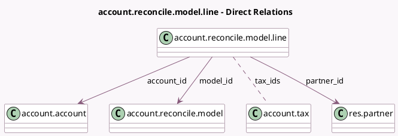

<!-- GENERATED:MODEL -->
---
tags: [odoo, community, generated, model]
---

# account.reconcile.model.line

- Module: [[docs/Community Addons/account/account|account]]
- Scope: Community Addons
- Defined in module: yes
- Source files: `models/account_reconcile_model.py`
- Python classes: `AccountReconcileModelLine`
- Description: Rules for the reconciliation model
- Inherits: `analytic.mixin`

## Field footprint

- Detected fields: 10
- Field types: `Char` x 2, `Float` x 1, `Integer` x 1, `Many2many` x 1, `Many2one` x 4, `Selection` x 1
- Relation fields: 5

## Sample fields

- `account_id`: `Many2one` (comodel `account.account`)
- `amount`: `Float` (compute `_compute_float_amount`, store `True`)
- `amount_string`: `Char`
- `amount_type`: `Selection`
- `company_id`: `Many2one` (related `model_id.company_id`, store `True`)
- `label`: `Char`
- `model_id`: `Many2one` (comodel `account.reconcile.model`)
- `partner_id`: `Many2one` (comodel `res.partner`)
- `sequence`: `Integer`
- `tax_ids`: `Many2many` (comodel `account.tax`)

## Method hints

- Detected methods: 3
- Action methods: none
- Compute methods: `_compute_float_amount`
- Onchange methods: `_onchange_amount_type`

## Direct relation diagram

## Navigation

- **Parent:** [[docs/Community Addons/account/Models]]

<!-- GENERATED:MODEL -->
