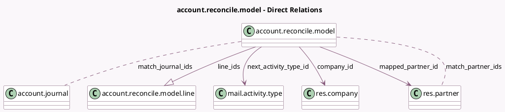

<!-- GENERATED:MODEL -->
---
tags: [odoo, community, generated, model]
---

# account.reconcile.model

- Module: [[docs/Community Addons/account/account|account]]
- Scope: Community Addons
- Defined in module: yes
- Source files: `models/account_reconcile_model.py`
- Python classes: `AccountReconcileModel`
- Description: Preset to create journal entries during a invoices and payments matching
- Inherits: `mail.thread`

## Field footprint

- Detected fields: 16
- Field types: `Boolean` x 2, `Char` x 2, `Float` x 2, `Integer` x 1, `Many2many` x 2, `Many2one` x 3, `One2many` x 1, `Selection` x 3
- Relation fields: 6

## Sample fields

- `active`: `Boolean`
- `can_be_proposed`: `Boolean` (compute `_compute_can_be_proposed`, store `True`)
- `company_id`: `Many2one` (comodel `res.company`)
- `line_ids`: `One2many` (comodel `account.reconcile.model.line`)
- `mapped_partner_id`: `Many2one` (comodel `res.partner`, compute `_compute_partner_mapping`, store `True`)
- `match_amount`: `Selection`
- `match_amount_max`: `Float`
- `match_amount_min`: `Float`
- `match_journal_ids`: `Many2many` (comodel `account.journal`)
- `match_label`: `Selection`
- `match_label_param`: `Char`
- `match_partner_ids`: `Many2many` (comodel `res.partner`)
- `name`: `Char`
- `next_activity_type_id`: `Many2one` (comodel `mail.activity.type`)
- `sequence`: `Integer`
- `trigger`: `Selection`

## Method hints

- Detected methods: 7
- Action methods: `action_reconcile_stat`, `action_set_auto_reconcile`, `action_set_manual`
- Compute methods: `_compute_can_be_proposed`, `_compute_partner_mapping`
- Onchange methods: none

## Direct relation diagram

## Navigation

- **Parent:** [[docs/Community Addons/account/Models]]

<!-- GENERATED:MODEL -->
