<!-- GENERATED:MODEL -->
---
tags: [odoo, community, generated, model]
---

# account.report.column

- Module: [[docs/Community Addons/account/account|account]]
- Scope: Community Addons
- Defined in module: yes
- Source files: `models/account_report.py`
- Python classes: `AccountReportColumn`
- Description: Accounting Report Column

## Field footprint

- Detected fields: 8
- Field types: `Boolean` x 2, `Char` x 2, `Integer` x 1, `Many2one` x 2, `Selection` x 1
- Relation fields: 2

## Sample fields

- `blank_if_zero`: `Boolean`
- `custom_audit_action_id`: `Many2one` (comodel `ir.actions.act_window`)
- `expression_label`: `Char`
- `figure_type`: `Selection`
- `name`: `Char`
- `report_id`: `Many2one` (comodel `account.report`)
- `sequence`: `Integer`
- `sortable`: `Boolean`

## Method hints

- Detected methods: 0
- Action methods: none
- Compute methods: none
- Onchange methods: none

## Direct relation diagram

```plantuml
@startuml
!define ODOO_COLOR_PRIMARY #714B67
!define ODOO_COLOR_ACCENT #875A7B
!define ODOO_COLOR_BG #FAF7FA

skinparam backgroundColor ODOO_COLOR_BG
skinparam defaultTextAlignment left
skinparam ArrowColor ODOO_COLOR_ACCENT
skinparam ClassBackgroundColor white
skinparam ClassBorderColor ODOO_COLOR_PRIMARY
skinparam ComponentBackgroundColor white
skinparam ComponentBorderColor ODOO_COLOR_PRIMARY
skinparam NoteBackgroundColor #FFF8FF
skinparam NoteBorderColor ODOO_COLOR_ACCENT
skinparam SequenceLifeLineBorderColor ODOO_COLOR_ACCENT
skinparam SequenceLifeLineBackgroundColor #FFFFFF
skinparam SequenceParticipantBorderColor ODOO_COLOR_PRIMARY
skinparam SequenceParticipantBackgroundColor #FFFFFF
skinparam sequence {
  ArrowColor ODOO_COLOR_ACCENT
  ActorBorderColor ODOO_COLOR_PRIMARY
}
title account.report.column - Direct Relations
class "account.report.column" as account_report_column
class "account.report" as account_report
class "ir.actions.act_window" as ir_actions_act_window
account_report_column --> account_report : report_id
account_report_column --> ir_actions_act_window : custom_audit_action_id
@enduml
```

## Navigation

- **Parent:** [[docs/Community Addons/account/Models]]

<!-- GENERATED:MODEL -->
