<!-- GENERATED:MODEL -->
---
tags: [odoo, community, generated, model]
---

# account.report.expression

- Module: [[docs/Community Addons/account/account|account]]
- Scope: Community Addons
- Defined in module: yes
- Source files: `models/account_report.py`
- Python classes: `AccountReportExpression`
- Description: Accounting Report Expression

## Field footprint

- Detected fields: 12
- Field types: `Boolean` x 3, `Char` x 5, `Many2one` x 1, `Selection` x 3
- Relation fields: 1

## Sample fields

- `auditable`: `Boolean` (compute `_compute_auditable`, store `True`)
- `blank_if_zero`: `Boolean`
- `carryover_target`: `Char`
- `date_scope`: `Selection`
- `engine`: `Selection`
- `figure_type`: `Selection`
- `formula`: `Char`
- `green_on_positive`: `Boolean`
- `label`: `Char`
- `report_line_id`: `Many2one` (comodel `account.report.line`)
- `report_line_name`: `Char` (related `report_line_id.name`)
- `subformula`: `Char`

## Method hints

- Detected methods: 16
- Action methods: none
- Compute methods: `_compute_auditable`, `_compute_display_name`
- Onchange methods: none

## Direct relation diagram

```plantuml
@startuml
!define ODOO_COLOR_PRIMARY #714B67
!define ODOO_COLOR_ACCENT #875A7B
!define ODOO_COLOR_BG #FAF7FA

skinparam backgroundColor ODOO_COLOR_BG
skinparam defaultTextAlignment left
skinparam ArrowColor ODOO_COLOR_ACCENT
skinparam ClassBackgroundColor white
skinparam ClassBorderColor ODOO_COLOR_PRIMARY
skinparam ComponentBackgroundColor white
skinparam ComponentBorderColor ODOO_COLOR_PRIMARY
skinparam NoteBackgroundColor #FFF8FF
skinparam NoteBorderColor ODOO_COLOR_ACCENT
skinparam SequenceLifeLineBorderColor ODOO_COLOR_ACCENT
skinparam SequenceLifeLineBackgroundColor #FFFFFF
skinparam SequenceParticipantBorderColor ODOO_COLOR_PRIMARY
skinparam SequenceParticipantBackgroundColor #FFFFFF
skinparam sequence {
  ArrowColor ODOO_COLOR_ACCENT
  ActorBorderColor ODOO_COLOR_PRIMARY
}
title account.report.expression - Direct Relations
class "account.report.expression" as account_report_expression
class "account.report.line" as account_report_line
account_report_expression --> account_report_line : report_line_id
@enduml
```

## Navigation

- **Parent:** [[docs/Community Addons/account/Models]]

<!-- GENERATED:MODEL -->
