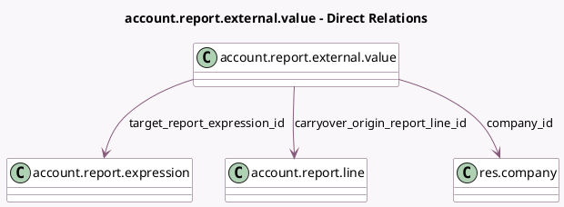

<!-- GENERATED:MODEL -->
---
tags: [odoo, community, generated, model]
---

# account.report.external.value

- Module: [[docs/Community Addons/account/account|account]]
- Scope: Community Addons
- Defined in module: yes
- Source files: `models/account_report.py`
- Python classes: `AccountReportExternalValue`
- Description: Accounting Report External Value

## Field footprint

- Detected fields: 11
- Field types: `Char` x 4, `Date` x 1, `Float` x 1, `Many2one` x 5
- Relation fields: 5

## Sample fields

- `carryover_origin_expression_label`: `Char`
- `carryover_origin_report_line_id`: `Many2one` (comodel `account.report.line`)
- `company_id`: `Many2one` (comodel `res.company`)
- `date`: `Date`
- `name`: `Char`
- `report_country_id`: `Many2one` (related `target_report_line_id.report_id.country_id`)
- `target_report_expression_id`: `Many2one` (comodel `account.report.expression`)
- `target_report_expression_label`: `Char` (related `target_report_expression_id.label`)
- `target_report_line_id`: `Many2one` (related `target_report_expression_id.report_line_id`)
- `text_value`: `Char`
- `value`: `Float`

## Method hints

- Detected methods: 0
- Action methods: none
- Compute methods: none
- Onchange methods: none

## Direct relation diagram

## Navigation

- **Parent:** [[docs/Community Addons/account/Models]]

<!-- GENERATED:MODEL -->
