<!-- GENERATED:MODEL -->
---
tags: [odoo, community, generated, model]
---

# account.report.line

- Module: [[docs/Community Addons/account/account|account]]
- Scope: Community Addons
- Defined in module: yes
- Source files: `models/account_report.py`
- Python classes: `AccountReportLine`
- Description: Accounting Report Line

## Field footprint

- Detected fields: 20
- Field types: `Boolean` x 3, `Char` x 9, `Integer` x 2, `Many2one` x 3, `One2many` x 2, `Selection` x 1
- Relation fields: 5

## Sample fields

- `account_codes_formula`: `Char` (store `False`)
- `action_id`: `Many2one` (comodel `ir.actions.actions`)
- `aggregation_formula`: `Char` (store `False`)
- `children_ids`: `One2many` (comodel `account.report.line`)
- `code`: `Char`
- `domain_formula`: `Char` (store `False`)
- `expression_ids`: `One2many` (comodel `account.report.expression`)
- `external_formula`: `Char` (store `False`)
- `foldable`: `Boolean`
- `groupby`: `Char`
- `hide_if_zero`: `Boolean`
- `hierarchy_level`: `Integer` (compute `_compute_hierarchy_level`, store `True`)
- `horizontal_split_side`: `Selection` (compute `_compute_horizontal_split_side`, store `True`)
- `name`: `Char`
- `parent_id`: `Many2one` (comodel `account.report.line`)
- `print_on_new_page`: `Boolean` (comodel `Print On New Page`)
- `report_id`: `Many2one` (comodel `account.report`, compute `_compute_report_id`, store `True`)
- `sequence`: `Integer`
- `tax_tags_formula`: `Char` (store `False`)
- `user_groupby`: `Char` (compute `_compute_user_groupby`, store `True`)

## Method hints

- Detected methods: 16
- Action methods: none
- Compute methods: `_compute_hierarchy_level`, `_compute_horizontal_split_side`, `_compute_report_id`, `_compute_user_groupby`
- Onchange methods: none

## Direct relation diagram

```plantuml
@startuml
!define ODOO_COLOR_PRIMARY #714B67
!define ODOO_COLOR_ACCENT #875A7B
!define ODOO_COLOR_BG #FAF7FA

skinparam backgroundColor ODOO_COLOR_BG
skinparam defaultTextAlignment left
skinparam ArrowColor ODOO_COLOR_ACCENT
skinparam ClassBackgroundColor white
skinparam ClassBorderColor ODOO_COLOR_PRIMARY
skinparam ComponentBackgroundColor white
skinparam ComponentBorderColor ODOO_COLOR_PRIMARY
skinparam NoteBackgroundColor #FFF8FF
skinparam NoteBorderColor ODOO_COLOR_ACCENT
skinparam SequenceLifeLineBorderColor ODOO_COLOR_ACCENT
skinparam SequenceLifeLineBackgroundColor #FFFFFF
skinparam SequenceParticipantBorderColor ODOO_COLOR_PRIMARY
skinparam SequenceParticipantBackgroundColor #FFFFFF
skinparam sequence {
  ArrowColor ODOO_COLOR_ACCENT
  ActorBorderColor ODOO_COLOR_PRIMARY
}
title account.report.line - Direct Relations
class "account.report.line" as account_report_line
class "account.report" as account_report
class "account.report.expression" as account_report_expression
class "account.report.line" as account_report_line
class "ir.actions.actions" as ir_actions_actions
account_report_line --|> account_report_expression : expression_ids
account_report_line --> account_report : report_id
account_report_line --> account_report_line : parent_id
account_report_line --|> account_report_line : children_ids
account_report_line --> ir_actions_actions : action_id
@enduml
```

## Navigation

- **Parent:** [[docs/Community Addons/account/Models]]

<!-- GENERATED:MODEL -->
